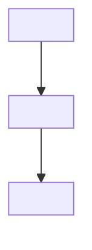

# Spec template for `docs/spec/<slug>/spec.md`

Write the spec with exactly these sections, in this order, keeping every heading and section number. Replace the italic guidance with real content. A section that genuinely does not apply says `N/A — <one-line reason specific to this change>`. Never delete a section, never renumber.

**Stable IDs.** Prefixes: `G-` goal, `NG-` non-goal, `INV-` invariant, `AC-` acceptance criterion, `EC-` edge case, `FR-`/`NFR-` requirement, `D-` decision, `T-` threat, `W-` work item, `A-` assumption, `Q-` question, `R-` review finding. Number from 1 within each prefix. IDs are never reused or renumbered; a withdrawn ID is struck through with the reason (`~~FR-3~~ (withdrawn r2: <reason>)`). Downstream agents (test author, implementer, reviewers, PR author) cite these IDs in file names, commit messages, and reports, so they must be stable.

**File paths** appear only in §11 and §12 and are true as of `base_commit`. §8 speaks in modules and interfaces so the design survives refactors.

**Code in the spec** is short and illustrative: signatures, type shapes, schema and index definitions, pseudocode, a request/response pair. Never a full implementation.

**No tests in the spec.** §13 records *facts* about the test layer for the test author. The test author designs and writes every test. Do not list test cases anywhere in this document.

````markdown
---
spec: <slug>
title: <Human-readable feature name>
status: draft            # draft | approved | tests-written | implemented | reviewed | verified | pr-open | abandoned
revision: 1
repo: <absolute path to the main checkout>
worktree: <absolute path to the pipeline worktree>
branch: <branch name>
base_commit: <full SHA of origin/main the worktree was created from>
created: <YYYY-MM-DD>
updated: <YYYY-MM-DD>
pr:                      # filled at S3 (draft) and finalized at S6
---

# Spec: <Human-readable feature name>

> **TL;DR** — <1–3 sentences: what changes, for whom, and the one design decision that matters most.>

## §0 User prompts

_The verbatim record of what the user asked lives in `docs/spec/<slug>/request.md` (every prompt in order, the handoff block if one exists, and the structured conversation notes). Reproduce here, verbatim, only the single prompt that invoked the pipeline. Do not paraphrase it. Every later section is your interpretation; this block is the ground truth it is checked against._

### 0.1 Invoking request (verbatim)
<the user's words exactly>

### 0.2 User replies during the run
_None yet. The orchestrator appends any reply the user sends during the run here verbatim, labeled with the revision it produced._

---

## Part A — Framing

## §1 Goal
_The outcome this change exists to produce, from the user's or customer's point of view. Measurable where possible. Why now, what hurts today, with evidence (a code path that does the wrong thing, a log line, a metric, the user's own words). One `G-n` per outcome._

| ID | Goal (outcome) | How we will know | Source |
|---|---|---|---|
| G-1 | | | request.md / §0 |

## §2 Objective
_The concrete deliverable of **this PR**, in one paragraph: what exists in the repo when it merges that does not exist today. This is the definition of done. If the goal needs several PRs, say which slice this one is and what later slices would be (those become `NG-` items below)._

## §3 Non-goals
_At least one, each with a reason. Include tempting adjacent work deliberately not done. Absence of a non-goal means the implementer fills the vacuum._

- **NG-1** — <thing> — *Why not:* <reason>

## §4 Developer usage
_A short, real code snippet showing how a developer uses the feature once this PR merges: the import, the call, the result. For an SDK feature, Python; for a CLI feature, the shell command and its exact stdout; for a backend feature, the route or server action and a response; for a frontend feature, the component in use. Use the exact names the design in §8 commits to — the test author will turn this snippet into `AC-1`, and the PR body will reprint it, so it must be literally correct._

```<lang>
<5–25 lines>
```

_One or two sentences on what the developer sees and what they do not have to do anymore._

## §5 Flow diagram
_Mermaid, end to end, from the trigger (route, CLI command, SDK call, event, UI action) to the terminal effect (DB write, response, emitted artifact). Each node names the module or function that does the step; each edge names the data that crosses it. Add a `sequenceDiagram` when more than one actor or service is involved. GitHub renders this in the PR body, so keep node labels short._



_Two to four sentences walking the diagram in prose, naming where validation happens, where state changes, and where failures are caught._

---

## Part B — Behavior (this is the spec; everything else is framing)

## §6 Behavior

### 6.1 Invariants
_Statements that must always hold, each independently testable. Cover the happy path; every user-visible state and transition; empty, loading, error, and cancel states; concurrency; and behaviors that must NOT regress. Use "always / never / exactly once" deliberately._

- **INV-1** — <statement>

**Must not regress:**
- **INV-n** — <existing behavior that must keep working, with the path that implements it today>

### 6.2 Acceptance criteria
_At least three, Given / When / Then, each independently testable, including negative criteria (what must NOT happen). `AC-1` is reserved for "the §4 snippet works exactly as written." The Proof column is filled later by the test author (test name) or the implementer (commit SHA)._

| ID | Given | When | Then | Priority | Proof |
|---|---|---|---|---|---|
| AC-1 | a clean checkout of this branch | the §4 snippet runs | it produces exactly the shown result | P0 | |

### 6.3 Edge cases and failure modes
_For each: the trigger (input + state), what the system does, what the user sees. Cover invalid input, concurrency and races, duplicates and retries, timeouts and offline, partial failure, dependency outage, empty or first-run state, scale extremes. The bar: name the input, the state, and the wrong output that would occur without the guard. "This could cause issues" is not allowed._

| ID | Trigger (input + state) | System behavior | User sees | Guarded by (INV-/D-) |
|---|---|---|---|---|
| EC-1 | | | | |

**Rollback of the user action:** <how a user or operator undoes the effect, and what state remains>

## §7 Requirements
_Functional and non-functional, stable IDs, priority (P0 must ship, P1 should, P2 could). Weighted words from the request ("always", "never", "every", "fast", "secure") must appear here as testable statements or measurable targets._

**Functional**
| ID | Requirement | Priority | Source (request.md / G-) |
|---|---|---|---|
| FR-1 | | P0 | |

**Non-functional**
| ID | Requirement | Priority | Target |
|---|---|---|---|
| NFR-1 | | P0 | |

---

## Part C — Design

## §8 Architecture and decisions
_Modules and interfaces, not file paths._

### 8.1 Decisions
| ID | Decision | Deciding reason | Runner-up | Flips if |
|---|---|---|---|---|
| D-1 | | | | |

### 8.2 Patterns inherited
- <Named pattern> — why it fits — where the repo already uses it (`path:symbol`)

### 8.3 Smaller design rejected
_The simplest design you considered and the specific requirement (FR-/INV-) it fails. Mandatory: if you cannot name one, you did not search for it._

### 8.4 Complexity budget
| Item | Count | Justification for each |
|---|---|---|
| New files | | |
| New classes/modules | | |
| New dependencies | | |
| New config keys | | |
| New collections/tables | | |
| New public endpoints/commands | | |

_The implementer may not exceed this budget without stopping and reporting BLOCKED._

### 8.5 Key interfaces
_Signatures and type shapes only, using the names the §4 snippet uses. These names are a contract: the test author writes tests against them and the implementer may not rename them._

```<lang>
<typed inputs and outputs>
```

## §9 Data, API, configuration, migration
_Only the subsections that exist for this change; the others say N/A with a reason._

### 9.1 Data model
_Every new or changed entity: fields with types, required/optional, defaults, uniqueness (natural key), indexes (equality → sort → range, covering or not), volume today → 12 months, lifecycle as a state machine. Unbounded arrays are forbidden._

### 9.2 API and interface surface
_REST / server action / CLI flag / public library function: shape, auth, validation at the boundary, error responses._

### 9.3 Configuration and flags
| Variable / key | Required | Default | Purpose | Lives in |
|---|---|---|---|---|

### 9.4 Migrations and compatibility
_Expand → backfill → contract; batched; resumable; safe with live traffic. Which public contracts change and the deprecation path for each._

## §10 Security and tenancy
| ID | Attacker | Shortest path to harm | Control | Where the control sits |
|---|---|---|---|---|
| T-1 | Careless user | | | server-side |
| T-2 | Hostile user | | | |
| T-3 | Compromised teammate / leaked credential | | | |
| T-4 | Another tenant | | | |

_Auth on every new endpoint or command; tenant isolation on every query (name the filter); secrets and PII through the repo's existing conventions (name them)._

## §11 Codebase grounding
_Everything a fresh agent needs to orient without re-auditing. All paths as of `base_commit`. Every claim cites where you saw it._

- **Rules read:** AGENTS.md (the sections that bind this change), nested rule files, folder READMEs
- **Field-guide entries applied:** `<path>` — <the lesson, in one line> (or "index empty")
- **Stack (from manifests):** <language + version, framework + version, DB + driver, test framework + version>
- **Commands (exact, from `context/code-map.md` §1 / AGENTS.md):**
  - Install: `…`
  - Lint: `…`
  - Typecheck: `…`
  - Test (focused): `…`
  - Test (full): `…`
  - Full local gate: `…`
  - Remote-only checks: <list or "none">
- **Baseline on clean `origin/main`:** <which gates pass; any pre-existing failures by name>
- **Directory layout relevant to this change:** <small tree>
- **Nearest sibling feature (the template to copy):** `<paths>` — <what to copy from it>
- **Reusable pieces:** `<path:symbol>` — <what it does, how this feature uses it>
- **Code-style exemplar** (`<path>`):
  ```<lang>
  <5–15 real lines, verbatim>
  ```
- **Domain glossary:** <term — meaning in this repo>
- **Prior specs / design docs / ADRs that constrain this:** <paths named by the orchestrator, or "none">
- **Conflicts between house style and AGENTS.md:** <none / list — AGENTS.md wins>

## §12 Work breakdown — everything this PR has to do
_This is the exhaustive action list. The implementer builds exactly this and nothing else; the reviewers check that exactly this was built. Go to the level of symbols. For every file, name the repo standard that governs how that kind of code is written here (placement rule, layering rule, header or README obligation, lint rule that will fire, field-guide lesson). If a standard applies and is not listed, the implementer will miss it._

### 12.1 Feature list
| ID | Feature (capability this PR adds) | Serves | Visible to |
|---|---|---|---|
| W-1 | | FR-/AC- | developer / end user / operator |

### 12.2 Folder and module map
_Each folder touched: what kind of code lives there per the repo's rules, whether a new folder needs a README, and the dependency direction that must hold (which layer may import which)._

| Folder | Kind of code (per repo rules) | New? | README / header obligation | May import from |
|---|---|---|---|---|

### 12.3 File-by-file actions
| # | Action | Path | Kind of code | What exactly changes (symbols, signatures, exports, registrations) | Governing standard (AGENTS.md § / placement rule / field-guide file / lint rule ID) | Serves | Phase |
|---|---|---|---|---|---|---|---|
| 1 | CREATE / MODIFY / DELETE | | enum / dataclass / service / route / command / middleware / component / fixture / doc / config | | | FR-/AC-/W- | P1 |

### 12.4 Standards checklist for this change
_Derived from AGENTS.md, folder READMEs, the field guide, and the house style. Each line is a concrete obligation the implementer must satisfy and a reviewer can tick. Examples of the kind of line expected: "every new enum lives in `vidbyte/lib/enums/<domain>.py` and is exported from `__init__.py`"; "each new module opens with the file header the repo uses"; "main functions are narrated in plain-English comments"; "no `vidbyte/lib/` module imports from a higher layer"; "lint rule B012 fires on bare dict returns — return the dataclass"._

- [ ] <obligation> — *source:* <where the rule is written>

### 12.5 Non-code actions
_README and folder README updates, `llms.txt` / repo map entries if the repo maintains them, `.env.example`, changelog, exports in `__init__`, registration lines, lint-baseline ratchet tightening after a genuine IMPROVED, docs that the repo requires per feature._

- <action> — <path> — *source of the obligation*

### 12.6 Phases and dependency order
_Phases that each leave the app building and existing tests passing. Order the §12.3 rows by phase; say which rows are independent._

**P1 — <name>** (ships: <what is usable after this phase>): rows <#…>
**P2 — …**

**Dependency order:** … **Independent:** …

## §13 Test seams (facts for the test author — no tests here)
_Framework and version; test directory layout and naming; fixtures and factories (paths); how integration tests reach the DB, network, filesystem, or subprocesses here; what must never be mocked in this repo; the one existing test file closest to this feature (prior art to copy); any per-area pytest or jest config; how to run one file and how to run the whole suite._

- **Framework:** …
- **Layout and naming:** …
- **Prior art to copy:** `<path>`
- **Fixtures / factories:** `<paths>`
- **Real seams (do not mock):** …
- **Per-area config:** …
- **Run one file:** `…` · **Run all:** `…`

## §14 Agent boundaries
- **Always:** <e.g. run the new tests after each work item; run the full local gate before pushing; keep edits inside the worktree; cite IDs in commit messages>
- **Ask first (stop and report BLOCKED):** <e.g. schema changes beyond §9; new dependencies; exceeding the §8.4 budget; touching files outside §12.3; changing a public contract not in §9.2; modifying any test file>
- **Never:** <e.g. commit secrets; delete, skip, or weaken failing tests; raise lint baselines or add suppressions; push to main; implement anything not in §12>

## §15 Assumptions and open questions
**Assumptions** (stand unless the user corrects them):
- **A-1** — <assumption> — *If wrong:* <what changes>

**Open questions** (max 5 blocking):
| ID | Question | Blocking? | Default if unanswered |
|---|---|---|---|
| Q-1 | | blocking / non-blocking | |

## §16 Review log
| Round | ID | Severity | Section | Finding (one line) | Disposition | Change made / reason |
|---|---|---|---|---|---|---|
| r1-1 | R-1 | | | | accepted / rejected / → Q-n | |

## §17 Revision history
| Revision | Date | Stage | Summary |
|---|---|---|---|
| r1 | <date> | S1 spec | Initial spec |
````
