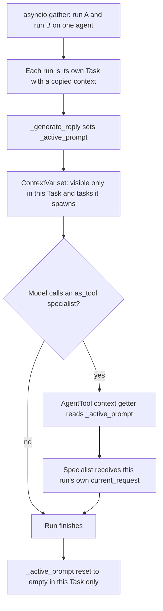

# Per-run active prompt

## Summary

`BaseAgent` stored the current run's prompt in a plain instance attribute, `_active_prompt`, and `AgentTool` forwards it to `as_tool()` specialists as `<current_request>`. When two runs share one agent concurrently (`asyncio.gather`), the later run overwrote the earlier run's prompt, so a specialist could receive another user's request: a cross-user data leak. This change backs `_active_prompt` with a per-instance `ContextVar`, so each run (asyncio Task) sees only its own prompt.

## Flow chart



## Usage example

```python
import asyncio
from vidbyte import Agent
from vidbyte.lib.dataclasses.agents import AgentMetadata

spec = Agent(name="billing", system_prompt="Billing specialist.",
             agent_metadata=AgentMetadata(name="billing", description="Billing", use_cases="billing"))
boss = Agent(name="concierge", system_prompt="Route.", tools=[spec.as_tool()])

# Each delegation now receives its own user's request.
alice, bob = await asyncio.gather(boss.arun("ALICE: refund invoice 111"), boss.arun("BOB: cancel plan 222"))
```

## How it works

- `BaseAgent.__init__` creates `self._active_prompt_var`, a `ContextVar[str]` with default `""`, in place of the plain attribute.
- A `_active_prompt` property reads `var.get()` and its setter calls `var.set(value)`. Every existing writer (`base.py`, `aggregation.py`, `multi/agent.py`, `multi/lifecycle.py`) goes through the property unchanged.
- The var is per instance, not module-level, so a nested specialist running in the same Task does not overwrite its parent's value.
- Parallel tool calls inside one run inherit the run's context, so the getter still sees that run's prompt.

## Files changed

- `vidbyte/agents/base.py`: ContextVar plus property.
- `tests/test_agent_tool.py`: one regression test with two concurrent runs.

## Risks

- Code reading `_active_prompt` from a different Task than the one that set it sees `""`. No such reader exists: the only reader is the AgentTool getter, which runs inside the run's Task.
- Fork, restore, and export build new agents through the constructor and never copy `__dict__`, so the ContextVar is never copied or serialized.

## Verification

- New test `ConcurrentRunContextTests.test_concurrent_runs_forward_their_own_prompt_to_agent_tool` fails before the change and passes after.
- Repro `a107_concurrent_specialist_context.py` prints `ok` for both users.
- `python lint/run.py` and `python scripts/run_ci.py` pass.
