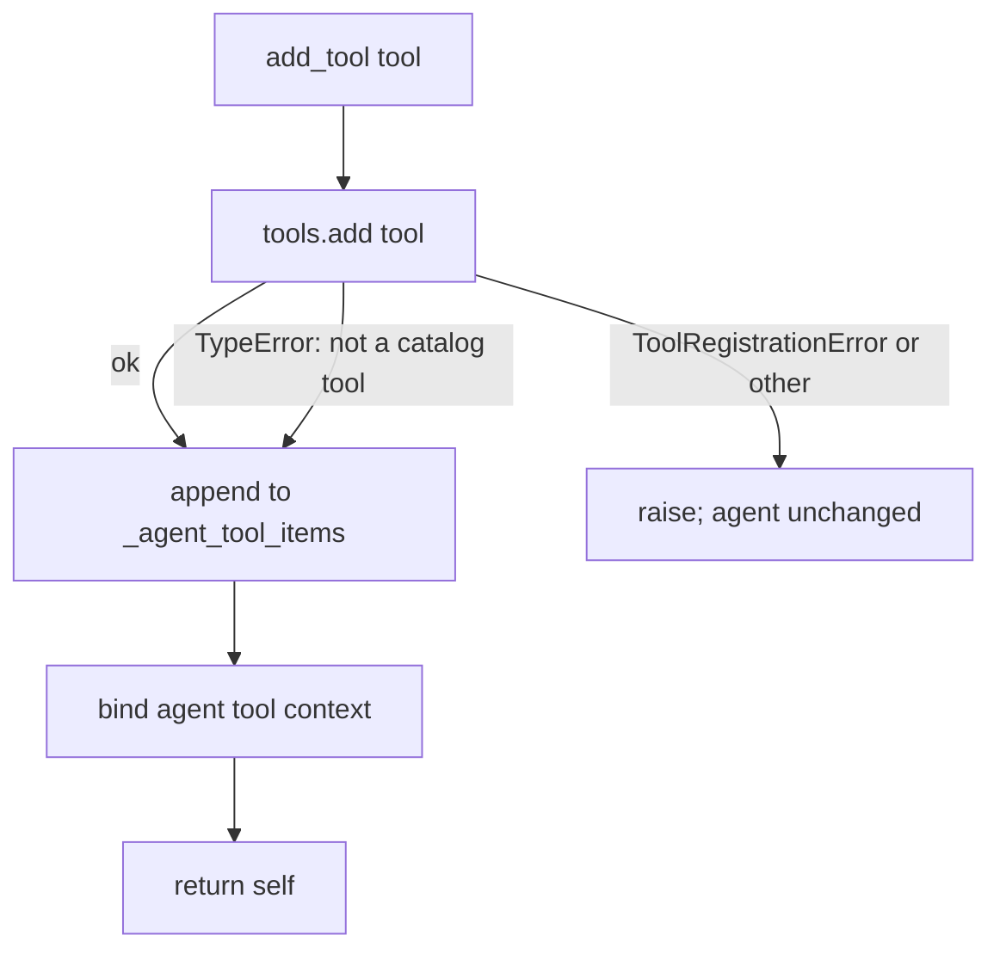

# Atomic `add_tool` on Rejection

## Summary

`BaseAgent.add_tool` recorded the tool in `_agent_tool_items` before adding it to the tool catalog. When the catalog rejected the tool (for example `ToolRegistrationError` on a duplicate name, including MCP tools attached through `McpAttachableMixin._attach_tools`), the error propagated but the duplicate stayed recorded. After that, every `fork()` failed with `Tool already exists`, and `export_state()` / `card()` listed the name twice. The fix records the tool only after the catalog add succeeds or is skipped through the existing `TypeError` path, so a rejected `add_tool` leaves the agent unchanged.

## Flow chart



## Usage example

```python
from vidbyte.lib.errors import ToolRegistrationError

agent = Agent(tools=[search])
try:
    agent.add_tool(other_search)  # also named "search"
except ToolRegistrationError:
    pass

agent.fork()                           # still works
agent.export_state().tool_names        # ("search",)
```

## How it works

In `add_tool`, call `self.tools.add(tool)` (keeping the `except TypeError: pass` skip) before appending to `_agent_tool_items` and binding agent context. Any other exception exits before state is touched.

## Files

- `vidbyte/agents/base.py`: reorder two statements in `BaseAgent.add_tool`.
- `tests/test_agent_base.py`: regression test for a duplicate-name `add_tool`.

## Risks

None expected: successful and `TypeError`-skipped paths produce the same final state as before. `Tools.add`, the constructor, and MCP attach are unchanged.

## Verification

New test asserts that after a duplicate-name `add_tool` raises, `_agent_tool_items` is unchanged, `fork()` works, and `export_state().tool_names` has no duplicate. Run `python lint/run.py` and `python scripts/run_ci.py`.
