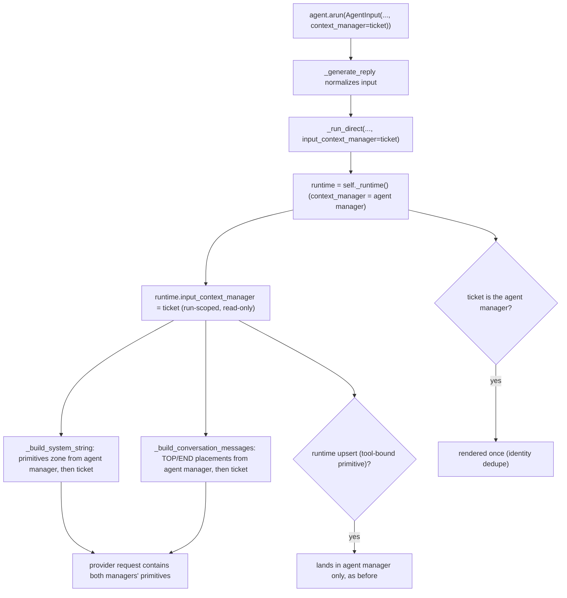

# AgentInput Context Manager Primitives

## Summary

`AgentInput(context_manager=...)` is the documented way to supply per-call context without
mutating the agent's default context. Unmanaged items on that manager already reached the
model, but its managed primitives (anything added with `upsert(...)`,
`place_after_system_prompt(...)`, or a conversation placement) were silently dropped:
`BaseAgent._merged_context_manager` copies only `.items()`, and the runtime renders the
primitives zone and conversation placements only from the agent's own manager. This fix
renders the per-call manager's primitives for that run only, without copying them into the
agent's persistent manager.

## Flow chart



## Usage example

```python
from vidbyte.agents import AgentInput
from vidbyte.context import ContextManager, TextContextItem

ticket = ContextManager()
ticket.place_after_system_prompt(TextContextItem(title="Ticket pin", content="Customer is on the Pro plan."))

reply = await agent.arun(AgentInput("refund?", context_manager=ticket))
# The "Ticket pin" primitive is in this run's system context.
# agent.context_manager.registry_items() is unchanged, so the next run does not see it.
```

## How it works

- `AgentRuntime.__init__` gains `self.input_context_manager: ContextManager | None = None`, a
  run-scoped manager that is rendered but never written to.
- A small `_render_context_managers()` helper returns the agent manager and then the input
  manager, skipping `None` and identical objects.
- `_build_system_string` joins each manager's `render_primitives_zone()`;
  `_build_conversation_messages` concatenates each manager's TOP/END conversation placements.
- `BaseAgent._generate_reply` passes the normalized input manager to `_run_direct`, which sets
  it on the runtime it builds for that run. Upserts (`self.context_manager.upsert`) are untouched.

## Files changed

- `vidbyte/agents/runtime.py` (init attribute; the two render helpers plus one helper)
- `vidbyte/agents/base.py` (`_generate_reply` and `_run_direct` plumbing)
- `tests/test_agent_base.py` (one regression test)

## Risks and open questions

- When both managers carry primitives, the system context shows two
  `## Context Window Primitives` sections (agent first, then input). Acceptable; no merging.
- Primitive ids are per manager, so two managers can show the same `[text:1]` id label.
- Only the text runner path through `_run_direct` gets the overlay; non-text runners never
  rendered primitives.

## Verification

- New test: input-placed and input conversation-placed primitives reach the runner, the agent
  manager's `registry_items()` is unchanged, and a following plain run does not see them.
  It fails on `main` and passes with the fix.
- `python scripts/run_ci.py`, then CI `ci.yml` and `static-policy.yml` on the branch.
