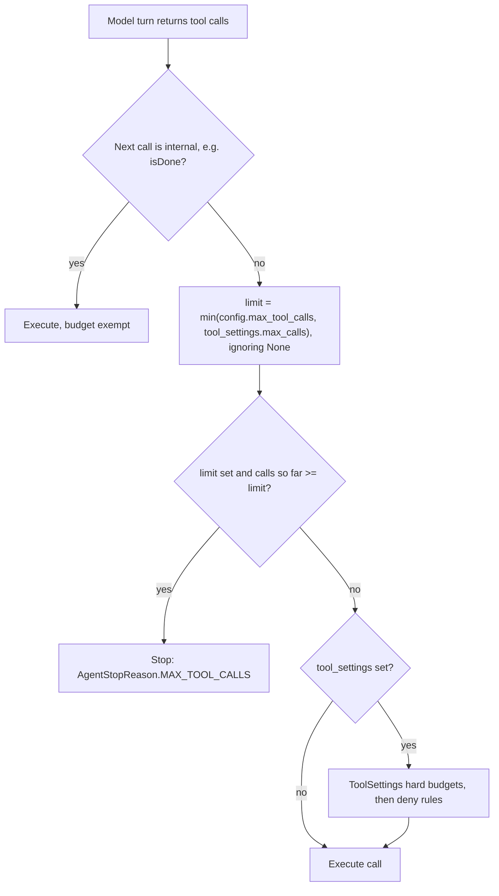

# Agent Loop Tool-Call Budget Before Execution

## Summary

`ToolSettings.max_calls` and `AgentLoopSettings.max_tool_calls` are documented as the same budget, and `AgentLoopSettings.to_runtime_config()` merges them into `AgentRuntimeConfig.max_tool_calls`. Only the `ToolSettings` path was checked before each call ran. With `AgentLoopSettings(max_tool_calls=N)` alone, the budget was checked only between iterations, so one model turn that asked for many parallel calls executed all of them. A turn with four `charge_card` calls and `max_tool_calls=2` charged the card four times, then reported `max_tool_calls`. This change applies the same pre-execution stop to both sources of the budget.

## Flow chart



## Usage example

```python
from vidbyte.agents.settings import AgentLoopSettings

agent = Agent(
    name="billing",
    system_prompt="Charge the customer.",
    tools=[charge_card],
    agent_loop_settings=AgentLoopSettings(max_tool_calls=2),
)
result = agent.run("Charge four installments.")
# Even if one model turn asks for four charge_card calls, only two execute.
assert result.metadata["stop_reason"] == "max_tool_calls"
```

## How it works

In `vidbyte/agents/runtime.py`, `_enforce_tool_settings` now returns early only for internal tools. It always runs `_tool_settings_budget_stop`, and returns early when `tool_settings is None` only after that check. `_tool_settings_budget_stop` accepts `ToolSettings | None` and uses the lower of `self.config.max_tool_calls` and `settings.max_calls`, skipping either one when it is `None`. The stop message and `AgentStopReason.MAX_TOOL_CALLS` are unchanged. The iteration-boundary check in `_budget_stop` stays as it is.

## Files

- `vidbyte/agents/runtime.py`: the two tool-budget methods above.
- `tests/test_agent_runtime.py`: one regression test in which a four-call fan-out turn under `AgentLoopSettings(max_tool_calls=2)` executes the tool exactly twice and stops with `max_tool_calls`.

## Risks

- A runtime with `max_tool_calls` but no `ToolSettings` now stops partway through a turn instead of at the end of it. This matches the documented budget and the existing `ToolSettings` behavior.
- Internal tools such as `isDone` stay exempt, as they were under `ToolSettings`.

## Verification

- The new test fails on `main` (four executions) and passes with the fix.
- `python scripts/run_ci.py` (lint, compileall, contract scripts, full pytest), plus the dispatched `ci.yml` and `static-policy.yml` workflows.
