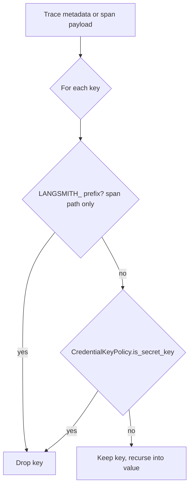

# Agent Trace Precise Secret Keys

## Summary

Agent tracing removed credential-like keys from trace payloads with substring matching, so any key containing `AUTH` or `TOKEN` was deleted. Ordinary fields such as `author_id`, `max_tokens`, `prompt_tokens`, and `auth_flow` vanished from traces along with real secrets. This change moves the agent trace scrubbers onto the shared `CredentialKeyPolicy.is_secret_key` classifier, which session trace artifacts and harness capture already use.

## Flow chart



## Usage example

```python
agent = Agent(
    name="pub",
    system_prompt="s",
    trace=tracer,
    metadata={"author_id": "u-7", "max_tokens": 64, "api_key": "sk-REAL"},
)
agent.run("publish the draft")
# Trace start metadata is now {"author_id": "u-7", "max_tokens": 64};
# before this change it was {}.
```

## How it works

- `BaseAgent._is_secret_trace_key` (trace start prompt, system prompt, tools, metadata) returns `CredentialKeyPolicy.is_secret_key(key)`.
- `vidbyte/agents/runtime.py::_safe_trace_mapping` (span payloads) keeps its `LANGSMITH_` prefix rule for env-style tracing config and otherwise uses the same classifier. The unused module-level copy in `vidbyte/agents/base.py` gets the same edit so no substring copy remains.
- Value recursion and `_trace_text` truncation are unchanged.

## Files

- `vidbyte/agents/base.py`
- `vidbyte/agents/runtime.py`
- `tests/test_tracing.py` (one regression test)

## Risks

A key that only contained a credential word mid-name (for example `myauththing`) is no longer dropped. That matches the policy already applied to session trace artifacts; the classifier still catches exact names and credential suffixes such as `_token`, `_secret`, and `_api_key`.

## Verification

The new test checks both scrubbers keep `author_id` and `max_tokens` and drop `api_key` and `auth_token`. Then `python lint/run.py` and `python scripts/run_ci.py`.
