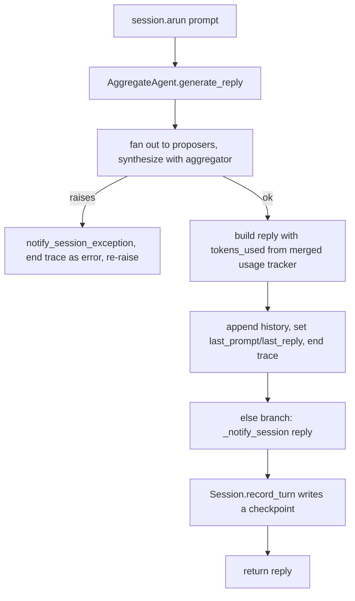

# AggregateAgent checkpoints its turns into a bound Session

## Summary

`AggregateAgent.generate_reply` replaces `BaseAgent`'s reply path entirely. Its failure branch already notifies a bound `Session`, but its success branch never called `_notify_session(reply)`, so a persisted AggregateAgent wrote no checkpoints: `Session.usage()` reported zero turns and tokens, and `Session.resume()` failed with "Cannot resume a session with no checkpoints." Its replies also carried no `tokens_used`, which is the key `Session.usage()` counts turns and tokens from. This change makes a successful aggregate turn checkpoint like a `BaseAgent` turn and report the merged proposer and aggregator tokens.

## Flow chart



## Usage example

```python
from vidbyte import AggregateAgent, AggregateConfig
from vidbyte.sessions import InMemorySessionStore, Session

store = InMemorySessionStore()
agg = AggregateAgent(
    name="moa",
    system_prompt="Answer carefully.",
    proposers=[("deepseek", "deepseek-v4-flash"), ("deepseek", "deepseek-v4-pro")],
    config=AggregateConfig(min_successful=2),
)
session = agg.persist(store=store)
await session.arun("First question")
await session.arun("Follow-up")

session.usage().turns   # 2 (was 0)
session.usage().tokens  # proposer + aggregator tokens for both turns (was 0)
Session.resume(store, session.id)  # restores both replies (previously raised SessionError)
```

## How it works

- After the reply is recorded and the trace is ended, an `else:` clause on the existing `try` calls `self._notify_session(reply)` and returns. `BaseAgent` likewise ends its trace, records the reply, then notifies the session. Because the call sits outside the `try`, nothing it raises can reach the `except` branch and end the trace a second time. `_notify_session` already swallows `Exception` and records it in `reply.metadata["__session_error__"]`.
- The reply metadata gains `tokens_used = self._usage_tracker.rollup().total_tokens`. When the reply is built, the tracker holds this run's merged proposer and aggregator usage. `SessionUsageBuilder` counts a history message as a turn only when its metadata has `tokens_used` (or `tool_call_count`), so without this key a checkpointed aggregate turn would still be invisible to `Session.usage()`. A provider that reports no total gives `None`. `BaseAgent` replies behave the same way: the turn still counts, with zero tokens.

## Files

- `vidbyte/agents/aggregation.py`: success-path session notification and `tokens_used` on the reply.
- `tests/test_aggregate_agent.py`: a regression test showing that a persisted AggregateAgent records one turn per reply, that the tokens add up across proposers and the aggregator, and that resume restores the history. The offline usage runner now also reports `total_tokens`.

## Risks

- AggregateAgent reply metadata gains a `tokens_used` key. Consumers that sum child `tokens_used` (for example, graders that wrap agents) now count aggregate runs that they previously counted as zero. That is correct accounting, not double counting, because the proposer replies never reach those consumers.

## Verification

- The new test fails on `main` (`turns 0 != 2`) and passes with the fix.
- `python lint/run.py` and `python scripts/run_ci.py` pass locally. The required CI checks pass on the PR.
