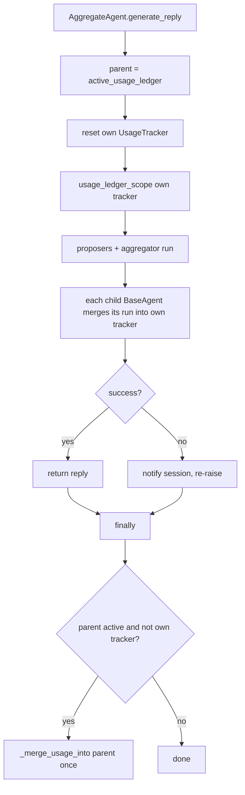

# AggregateAgent Usage Rollup

## Summary

`AggregateAgent` overrides `generate_reply` and runs its proposer and aggregator child agents through `MultiProviderAggregator`, so it never went through `BaseAgent`'s usage bookkeeping. Its inherited `get_usage()` / `get_cost_usd()` therefore always reported zero calls and no cost, even after a run that made several priced model calls. This fix resets the agent's own `UsageTracker` at the start of each run, opens it as the active usage ledger while the children run (so each child's existing `BaseAgent.generate_reply` hook merges its rollup into it), and, when an outer ledger was already active, merges this run's rollup into that outer ledger exactly once.

## Flow chart



## Usage example

```python
agg = AggregateAgent(
    name="agg",
    system_prompt="Answer well.",
    proposers=[ProposerSpec("deepseek", "deepseek-v4-flash")] * 3,
    aggregator=("deepseek", "deepseek-v4-flash"),
)
await agg.arun("Explain CRDTs.")
agg.get_usage().model_call_count  # 4 (3 proposers + 1 aggregator), reset each run
agg.get_cost_usd()                # priced total for this run
```

## How it works

- `vidbyte/agents/aggregation.py`: in `AggregateAgent.generate_reply`, capture `active_usage_ledger()`, call `self._usage_tracker.reset()`, wrap `self._engine.aggregate(prompt)` in `usage_ledger_scope(self._usage_tracker)`, and in the existing `finally` call `self._merge_usage_into(parent)` when an outer ledger (other than its own tracker) was active. This mirrors `BaseAgent.generate_reply`; proposer tasks inherit the scope because `asyncio` copies the context when they are created.
- `tests/test_aggregate_agent.py`: one regression test with three metered `BaseAgent` proposers and a metered aggregator (offline runner), asserting four calls per run, no accumulation across runs, and exactly four calls in an outer ledger.

## Risks

- Failed proposers that billed usage are counted only to the extent the child's own tracker records them; unchanged from `BaseAgent`.
- Non-`BaseAgent` duck-typed proposers record nothing, as before.

## Verification

The new test fails on `main` and passes with the fix; `scripts/run_ci.py` locally; CI `ci.yml` and `static-policy.yml` on the branch.
