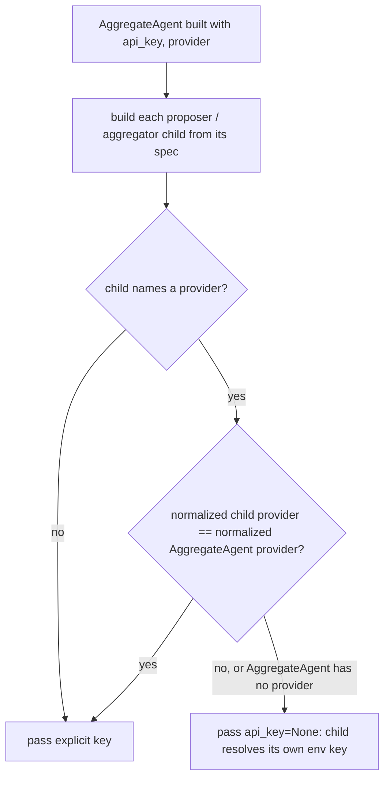

# AggregateAgent never sends its explicit key to another provider

## Summary

`AggregateAgent` takes one `api_key` and passed it to every proposer and aggregator child it builds, whatever provider each child names. The point of AggregateAgent is to run proposers across providers, so an explicit key meant that every proposer on another provider sent the host vendor's secret to that other vendor. The secret leaked and the call failed auth. For example, an OpenAI proposer sent `Authorization: Bearer sk-deepseek-...` to api.openai.com. This change gives a child the explicit key only when the child's provider matches the provider the key belongs to. Any other child gets `api_key=None`, so `BaseAgent` reads that provider's own environment credential. Fallback chains already follow this rule (`_inherited_api_key`, `@intent fallback-key-never-crosses-providers`, PR #592).

## Flow chart



## Usage example

```python
from vidbyte import AggregateAgent, AggregateConfig

# OPENAI_API_KEY is set in the environment.
panel = AggregateAgent(
    name="panel",
    system_prompt="Answer.",
    provider="deepseek",
    model_name="deepseek-v4-flash",
    api_key="sk-deepseek-SECRET",           # belongs to deepseek
    proposers=[("deepseek", "deepseek-v4-flash"), ("openai", "gpt-5.4-mini")],
    config=AggregateConfig(min_successful=2),
)
await panel.arun("question")
# deepseek proposer + aggregator -> sk-deepseek-SECRET
# openai proposer               -> OPENAI_API_KEY (previously sk-deepseek-SECRET)
```

## How it works

- A new helper, `AggregateAgent._child_api_key(child_provider)`, normalizes both the AggregateAgent's `provider` argument and the child's provider. Strings and `ModelProvider` enums both reduce to a stripped, lower-cased value, the same way `_inherited_api_key` does it. The helper returns the explicit key only when the child names no provider or names the same one. Otherwise it returns `None`.
- `_build_proposer_agent` and `_build_aggregator` pass `api_key=self._child_api_key(spec.provider)` instead of the raw key.
- `fork()` still passes `api_key=self._proposer_api_key` to the rebuilt AggregateAgent. That is the host key, and the fork applies the same rule to its own children.
- Edge case, `api_key` without `provider`: nothing says which vendor the key belongs to, and `BaseAgent` has no default provider to assume. Every spec-built child names a provider (`ProposerSpec.provider` is required, and tuples must start with a string). So the key cannot be attributed, and no child sends it. The aggregator in this case must be an explicit spec, because the default aggregator needs `provider`. This fails closed: at worst a same-provider child falls back to its env key and errors with a missing-key message. The other option would leak a secret to an unknown vendor.

## Files

- `vidbyte/agents/aggregation.py`: the `_child_api_key` helper with an `@intent aggregate-key-never-crosses-providers` marker, used by both child builders.
- `tests/test_aggregate_agent.py`: three regression tests. (1) A cross-provider proposer gets no key, while same-provider proposers (including a differently cased spec and a `ModelProvider` host value) and the default aggregator keep it. (2) An explicit aggregator on another provider gets no key. (3) A key given without a provider reaches no named child.

## Risks

- A caller who passed `api_key` without `provider` and relied on it reaching same-provider proposers now needs to pass `provider=` or set the env key. This is intentional (see the edge case above).
- `fork.py` gets the same rule in a separate PR. That file is not touched here.

## Verification

- The three new tests fail on `main` and pass with the fix.
- `python lint/run.py` and `python scripts/run_ci.py` pass locally. The required CI checks pass on the PR.
