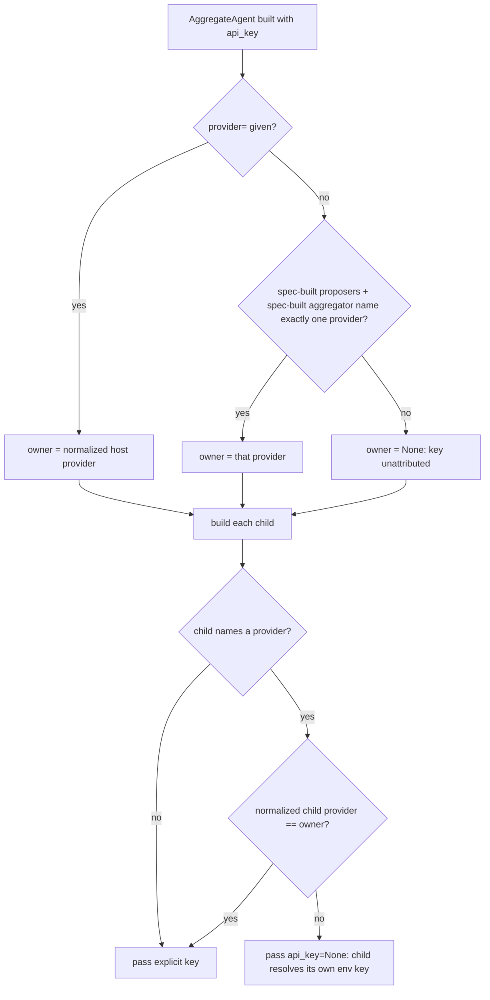

# AggregateAgent attributes a provider-less key to a single-vendor panel

## Summary

PR #611 (`aggregate-key-never-crosses-providers`) made `AggregateAgent` give its explicit `api_key` only to children on the AggregateAgent's own `provider`. When `provider=` is not given, #611 gives the key to no child that names a provider. That broke a setup that worked before: a single-vendor panel where every proposer and an explicit aggregator name the same provider and the key is passed only as `api_key`. Every child got `api_key=None`, so with no env key the run failed with `AggregateExecutionError: Aggregate run produced 0 successful proposer(s)`. This change keeps #611's guarantee, which is that a key never reaches a provider it does not belong to. It also attributes the key when there is no host provider: in that case the key belongs to the one provider that all spec-built children name.

## Flow chart



## Usage example

```python
from vidbyte import AggregateAgent, AggregateConfig

# No DEEPSEEK_API_KEY in the environment, and no provider= on the panel.
panel = AggregateAgent(
    name="panel",
    system_prompt="Answer.",
    api_key="sk-deepseek-TEAM",
    proposers=[("deepseek", "deepseek-v4-flash"), ("deepseek", "deepseek-v4-pro")],
    aggregator=("deepseek", "deepseek-v4-flash"),
    config=AggregateConfig(min_successful=2),
)
await panel.arun("question")  # every proposer and the aggregator send sk-deepseek-TEAM
```

## How it works

- `__init__` calls a new helper, `_resolve_key_owner()`, before it builds any child and stores the result as `self._key_owner`. The helper returns the normalized host `provider` when one is set. Otherwise it collects the providers of the spec-built children (proposers given as tuples or `ProposerSpec`, plus the aggregator when it is a spec), normalizes them, and returns the provider only if exactly one remains. In every other case it returns `None`.
- `_child_api_key(child_provider)` now compares the normalized child provider against `self._key_owner` instead of the host provider. Normalization is unchanged: `ModelProvider` values and strings are stripped and lower-cased.
- Prebuilt agent instances passed as proposers or aggregator are not built by AggregateAgent. They do not count toward the owner and are unaffected.
- `fork()` passes the same inputs, so the fork resolves the same owner.

## Files

- `vidbyte/agents/aggregation.py`: the `_resolve_key_owner` helper, the `_key_owner` field set in `__init__`, and `_child_api_key` comparing against it. Both helpers carry `@intent aggregate-key-never-crosses-providers`, which now states the rule.
- `tests/test_aggregate_agent.py`: #611's "key without a provider" test is replaced by two tests. With no host provider, a panel whose children all name one provider (mixed case and spacing) gives every child the key. With no host provider, a panel whose proposers and aggregator name different providers gives no child the key.

## Risks

- A provider-less key over a single-vendor panel is assumed to belong to that vendor. This matches the behavior before #611, and the key cannot reach any other vendor, because a mixed panel still leaves it unattributed.

## Verification

- #611's two cross-provider tests (host provider set) pass unchanged.
- The single-vendor test fails on `main` and passes with the fix. The mixed-provider test passes on both.
- `python lint/run.py` and `python scripts/run_ci.py` pass locally. The required CI checks pass on the PR.
