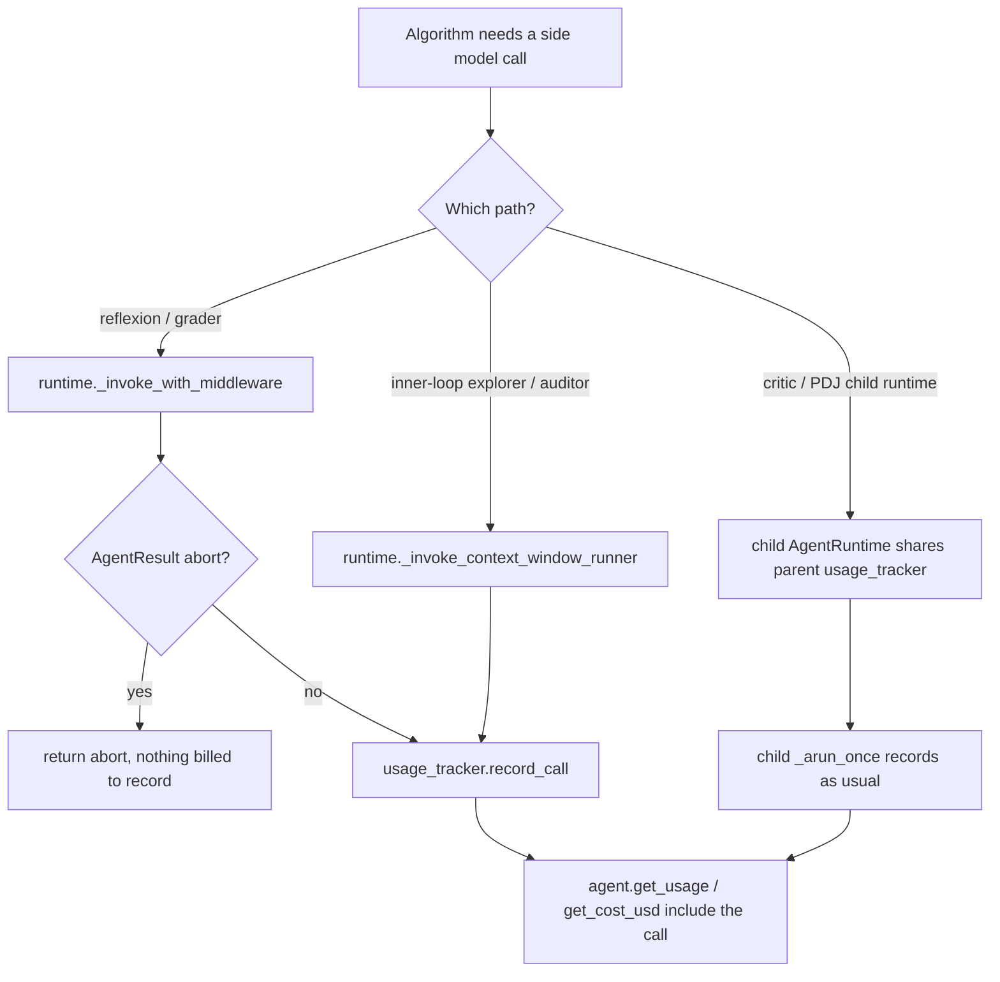

# Algorithm side-call usage metering

## Summary

Context-window algorithms make extra model calls outside the main agent loop: the Reflexion reflection call, the multi-provider grader call, inner-loop explorers/auditors (problem-space search, error correction, trajectory checkpoints), and the child runtimes of the independent critic and prosecutor/defender/judge. None of these reached the runtime's `UsageTracker`, so `get_usage()` and `get_cost_usd()` under-reported real provider spend (e.g. reflexion: 3 provider requests, 2 counted). This change records every such call in the run's one ledger.

## Flow chart



## Usage example

```python
agent = Agent(system_prompt="Work.", model="deepseek-v4-flash", context_window=ContextWindow.preset.reflexion)
agent.run("task")
usage = agent.get_usage()
# model_call_count now equals the provider requests made, including the reflection call.
print(usage.model_call_count, agent.get_cost_usd())
```

## How it works

- `AgentRuntime._invoke_context_window_runner` becomes an instance method that calls `self.usage_tracker.record_call(response)` after `runner.invoke(...)`.
- `reflexion.py` and `multi_provider_agentic_grader.py` call `self.runtime.usage_tracker.record_call(raw_result)` after `_invoke_with_middleware` when the result is not an `AgentResult`.
- `independent_critic.py` and `prosecutor_defender_judge.py` pass `usage_tracker=` the parent runtime's tracker into the child `AgentRuntime` they build.
- Token-budget accounting (`state.tokens_used`) is unchanged.

## Files

- `vidbyte/agents/runtime.py`
- `vidbyte/agents/algorithms/reflexion.py`, `multi_provider_agentic_grader.py`, `independent_critic.py`, `prosecutor_defender_judge.py`
- `tests/test_algorithm_side_call_usage.py` (new)

## Risks

- Child runtimes now report the shared ledger in their own `usage_rollup` metadata; that metadata is internal to the algorithm and not surfaced as the agent's usage.
- A side response without parseable usage is counted as unaccounted, matching the main loop.

## Verification

New offline regression test asserts `usage_tracker.rollup().model_call_count == runner invocations` for a reflexion run and a problem-space-search run (both fail before the fix). Full gate: `python scripts/run_ci.py`, `python lint/run.py`, then CI.
