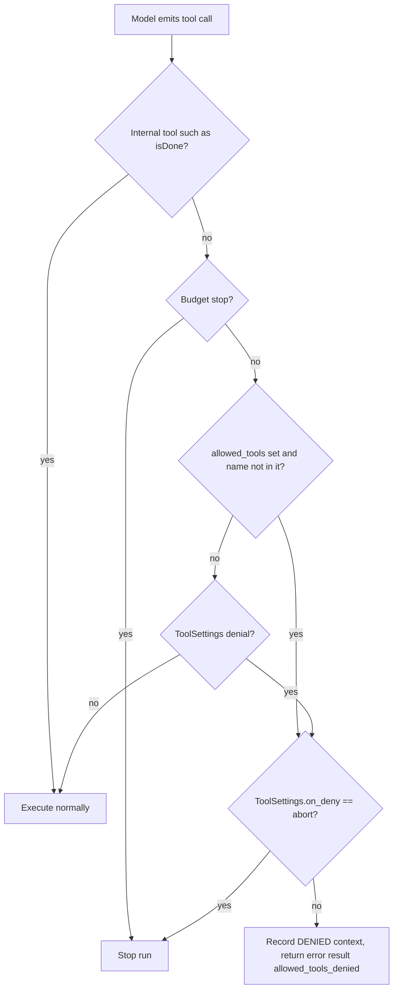

# Enforce AgentLoopSettings.allowed_tools

## Summary

`AgentLoopSettings.allowed_tools` is public, validated, exported and restored with agent
state, inherited by forks, and described to the model by the fork tool as a runtime gate.
Nothing in the runtime read it, so an agent limited to `("read_note",)` could still call
`delete_note`. This change carries the value into `AgentRuntimeConfig` and refuses any
non-internal call outside it at the same pre-execution point where
`ToolSettings.denied_tools` is enforced.

## Flow chart



## Usage example

```python
from vidbyte import Agent
from vidbyte.agents.settings import AgentLoopSettings

agent = Agent(
    name="reader",
    system_prompt="Read notes; never delete them.",
    tools=[read_note, delete_note],
    agent_loop_settings=AgentLoopSettings(max_iterations=4, allowed_tools=("read_note",)),
)
# A delete_note call now returns a tool error with metadata error="allowed_tools_denied"
# and the tool never runs; read_note and isDone behave as before.
```

## How it works

- `AgentRuntimeConfig` gains `allowed_tools: frozenset[str] | None`, filled by
  `AgentLoopSettings.to_runtime_config()`.
- `AgentRuntime._enforce_tool_settings` checks the gate after the budget checks and before
  the `ToolSettings` denial, and reuses `_apply_tool_denial`, so the refusal looks exactly
  like a denied tool and honors `ToolSettings.on_deny`. Internal tools are skipped by the
  existing `tool_is_internal` early return.
- Tool specs sent to the model are not filtered, matching `denied_tools` today.

## Files

- `vidbyte/lib/dataclasses/agents.py`, `vidbyte/agents/settings/loop.py`, `vidbyte/agents/runtime.py`
- `tests/test_agent_runtime.py`: regression test.

## Risks

Agents that set `allowed_tools` but relied on it being ignored will now see refusals; that
is the documented behavior.

## Verification

Regression test (refused tool does not execute, allowed tool runs, isDone finishes), the
external probe `a294_allowed_tools_gate.py` prints `BAD total 0`, `python lint/run.py`, and
`python scripts/run_ci.py`.
