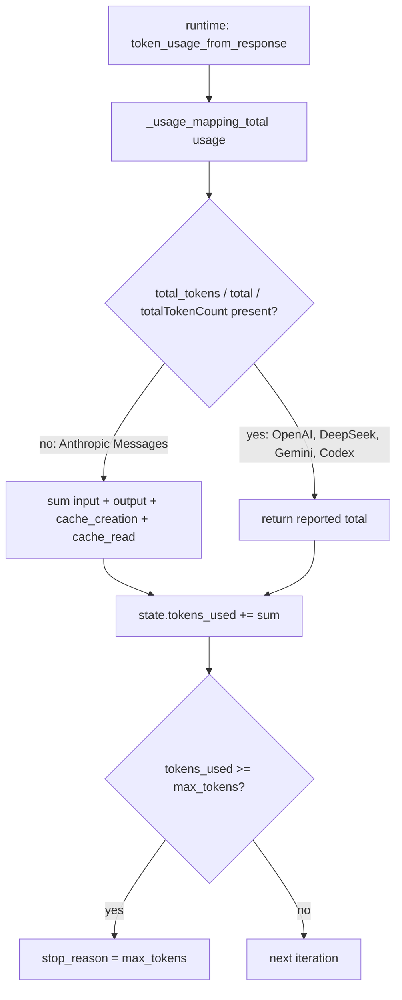

# Count Anthropic Cache Tokens in the Runtime Token Budget

## Summary

`vidbyte/lib/token_usage.py::_usage_mapping_total` totals one provider usage mapping. When no total key is present it sums the input and output buckets, but it skips Anthropic's `cache_creation_input_tokens` and `cache_read_input_tokens`. Anthropic bills those on top of `input_tokens`, so the runtime's `state.tokens_used` undercounts any cached run. That number enforces `AgentLoopSettings(max_tokens=...)`, is reported as `metadata["tokens_used"]`, and appears in the loop-budget block. In the reproduction, a 5,000-token budget never tripped across 5 calls that used 100,350 tokens, and the reply reported 350. The fix adds both cache buckets to the fallback sum, so the count matches `AnthropicUsage.total_tokens`.

## Flow chart



## Usage example

```python
from vidbyte.lib.token_usage import token_usage_from_response

usage = {"input_tokens": 50, "output_tokens": 20, "cache_read_input_tokens": 20000, "cache_creation_input_tokens": 0}
assert token_usage_from_response(object(), {"usage": usage}) == 20070  # was 70
```

## How it works

The fallback sum in `_usage_mapping_total` gets two more keys: `cache_creation_input_tokens` and `cache_read_input_tokens`. This path runs only when no total key is present. OpenAI chat, OpenAI Responses, OpenAI-compatible (DeepSeek and others), Gemini and Codex payloads all report a total key, and they keep their cached counts in other places (`input_tokens_details`, `prompt_tokens_details`, `prompt_cache_hit_tokens`, `cachedContentTokenCount`), so their totals do not change. An `@intent` marker records why the cache buckets are in the sum.

## Files changed

- `vidbyte/lib/token_usage.py`: two keys added to the fallback sum, plus the `@intent` comment.
- `tests/test_agent_runtime.py`: one regression test.

## Risks

A payload that has no total key and is not from Anthropic could include these exact key names and get counted twice. No provider adapter in the SDK produces that shape today.

## Verification

`test_runtime_max_tokens_counts_anthropic_cache_buckets` runs an Anthropic-shaped response with 20,000 cache-read tokens against `max_tokens=5000`. It checks that the run stops after one call with `stop_reason == "max_tokens"` and `tokens_used == 20070`. The test fails without the fix. After that, `python lint/run.py` and `python scripts/run_ci.py`.
