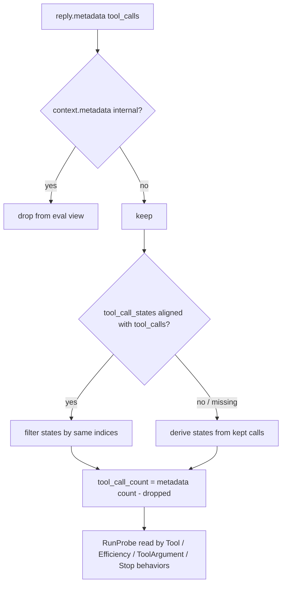

# Behavior evals exclude internal tools

## Summary

`agent.behavior` evals read tool calls from the run's result metadata, which includes the runtime's internal `isDone` finish tool. A run that calls `lookup` and then finishes with `isDone` fails `called_only_tools(["lookup"])` and reports one extra tool call. The same run finishing with plain text passes. `RunProbe` now drops contexts the runtime stamped `metadata["internal"]`, so eval verdicts no longer depend on how the run finished. The output-contract counters already exclude internal tools in the same way.

## Flow chart



## Usage example

```python
agent.run("look up the order")          # model calls lookup, then isDone
b = agent.behavior
assert b.tool.called_only_tools(["lookup"])
assert b.tool.called_tool_names() == ("lookup",)
assert b.stop.total_tool_calls() == 1
```

## How it works

A private `RunProbe._developer_tool_view(md)` helper is used by both `_from_reply_and_agent` and `_from_reply_only`. It filters out internal contexts, filters `tool_call_states` by the same indices when they line up with `tool_calls` (otherwise it derives them from the kept calls), and lowers `tool_call_count` by the number of dropped contexts. The runtime's result metadata is not changed.

## Files

- `vidbyte/evals/behavior/probe.py`: adds the helper and uses it in both construction paths.
- `tests/test_agent_behavior.py`: adds one regression test.

## Risks

A run made up only of internal calls now reports `called_no_tools()` True and a `tool_call_count` of 0. That is the intended behavior. A `RunProbe(...)` built by hand is not filtered.

## Verification

Run `tests/test_agent_behavior.py`, `python lint/run.py`, and `python scripts/run_ci.py`. The repro `a103_behavior_evals.py` should go from 12/15 to 15/15.
