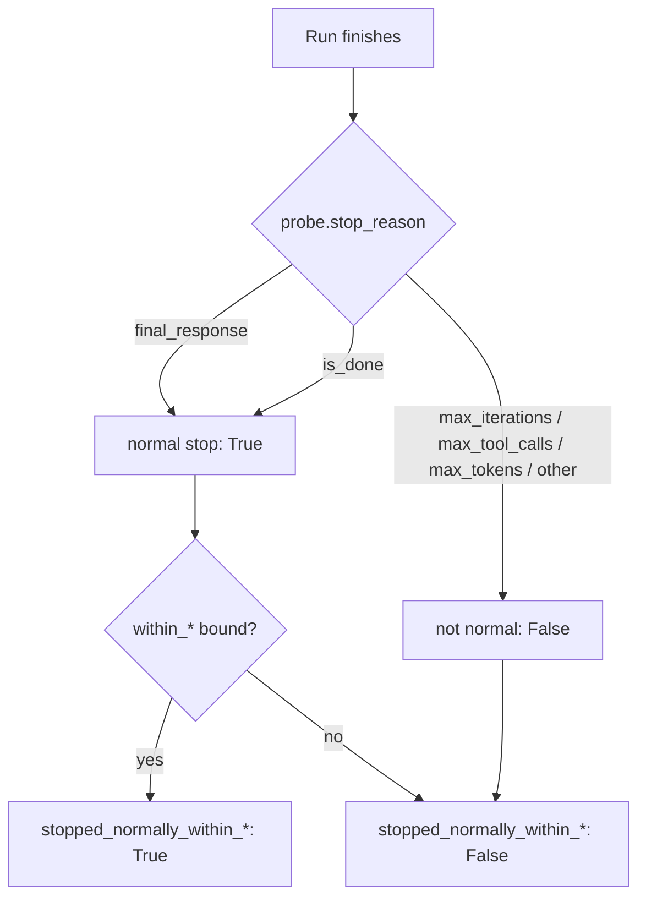

# Behavior evals: isDone is a normal stop

## Summary

The runtime records two normal-completion stop reasons: `final_response` (the model
replied with plain text) and `is_done` (the model called the internal `isDone` tool,
which the SDK's own agentic-loop prompt tells it to do when finished). The
`agent.behavior` eval predicates treated only `final_response` as normal, so a run
that finished the canonical way reported `stopped_normally() == False`. This change
makes `StopBehavior.stopped_normally()` and the two
`EfficiencyBehavior.stopped_normally_within_*` predicates accept both reasons.

## Flow chart



## Usage example

```python
agent.run("Look up the order status and finish with isDone.")
assert agent.last_reply.metadata["stop_reason"] == "is_done"

assert agent.behavior.stop.stopped_normally()
assert agent.behavior.efficiency.stopped_normally_within_iterations(5)
assert agent.behavior.efficiency.stopped_normally_within_tool_calls(3)
```

## How it works

`StopBehavior` gains one class-level set, `NORMAL_STOP_REASONS`, holding the
`FINAL_RESPONSE` and `IS_DONE` values, and `stopped_normally()` checks membership in
it. `EfficiencyBehavior._stopped_normally()` reuses that same set, so the definition
of "normal completion" lives in one place. Budget predicates (`did_not_hit_*`,
`did_not_stop_on_budget`) and `stopped_on()` are unchanged.

## Files changed

- `vidbyte/evals/behavior/stop.py`: add `NORMAL_STOP_REASONS`, use it in `stopped_normally()`.
- `vidbyte/evals/behavior/efficiency.py`: `_stopped_normally()` uses the shared set.
- `tests/test_agent_behavior.py`: regression assertions that `is_done` is normal for all three predicates.

## Risks and open questions

- Callers that relied on `stopped_normally()` to tell plain-text finishes apart from
  `isDone` finishes now get True for both; `stopped_on("final_response")` still
  distinguishes them.

## Verification

- `python lint/run.py` and `python scripts/run_ci.py` pass.
- Probe `a299_behavior_isdone_normal.py` prints `BAD total 0` after merge.
