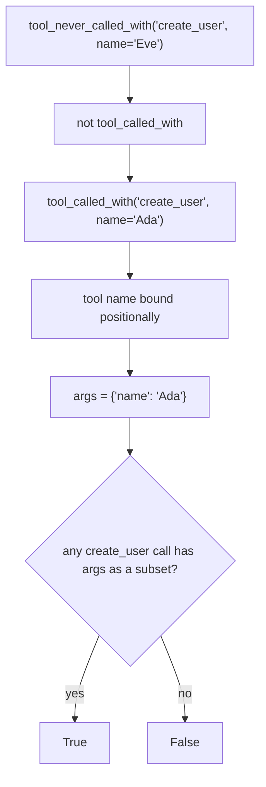

# Behavior Predicates Can Check an Argument Named `name`

## Summary

`ToolArgumentBehavior.tool_called_with(name, **args)` and `tool_never_called_with(name, **args)` took the tool name as an ordinary parameter called `name`. A tool argument that is itself called `name` could never be checked: Python bound `name=` to the tool-name parameter and raised `TypeError: got multiple values for argument 'name'`. The fix makes the tool-name parameter positional-only in both methods, so `name="Ada"` lands in `**args`.

## Flow chart



## Usage example

```python
@tool
async def create_user(name: str, role: str) -> str: ...

# After the model calls create_user(name="Ada", role="admin"):
agent.behavior.tool_args.tool_called_with("create_user", name="Ada")        # True
agent.behavior.tool_args.tool_never_called_with("create_user", name="Eve")  # True
```

## How it works

Add `/` after the `name` parameter in both method signatures. Existing positional call sites are unchanged; no call site in `vidbyte/`, `tests/`, or `skills/` passes the tool name by keyword.

## Files

- `vidbyte/evals/behavior/tool_arguments.py`: positional-only `name` in two signatures, plus an `@intent` marker.
- `tests/test_agent_behavior.py`: one regression test.

## Risks

A caller that passed the tool name as `name=` by keyword now gets a `TypeError`. None exist in the repo, and the package is alpha.

## Verification

`python lint/run.py`, `python scripts/run_ci.py`, and the new test `test_tool_args_can_check_argument_named_name`.
