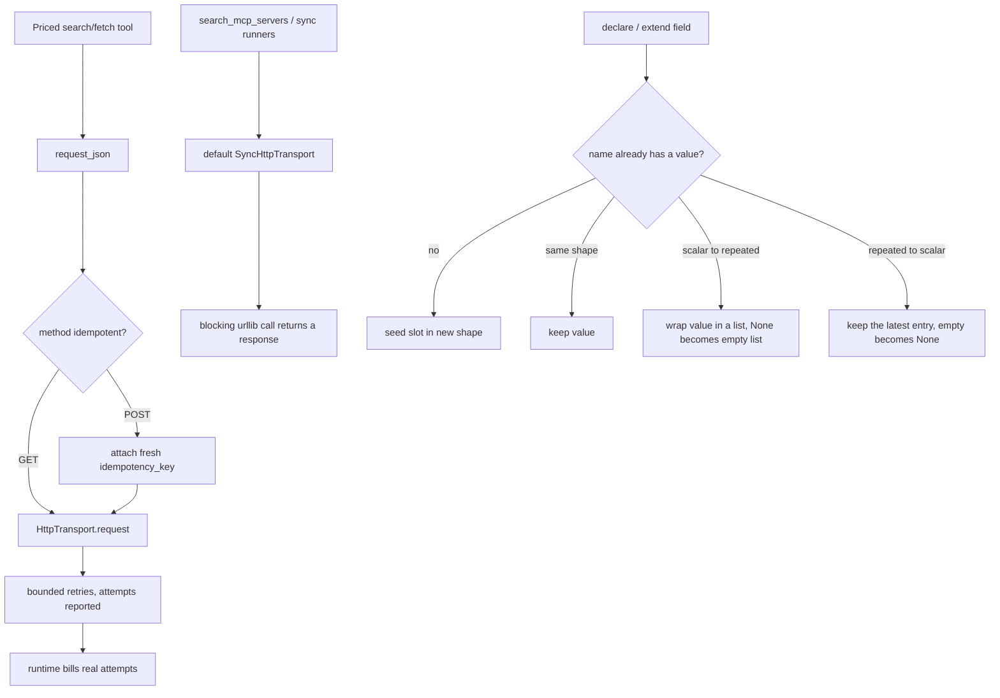

# Built-in Tool Transport and Output Builder Fixes

## Summary

Four independent bugs made built-in tools and runners fail on their default configuration:

1. **POST web operation clients never sent a request.** `WebOperationClient.request_json` asked `HttpTransport` for retries (`retry_count=2` by default) with no `idempotency_key`, so the transport's retry guard raised before any I/O. Exa, Firecrawl, Tavily, Parallel and Browserbase failed every call, and each failure billed 3 phantom attempts.
2. **Smithery search always failed.** The synchronous `SmitheryRegistryClient` defaulted to the async `HttpTransport` and read `status_code` off an un-awaited coroutine.
3. **`OutputSchemaBuilder` kept a stale value slot** when a field was re-declared with a different `repeated` flag, so the next `append_output` crashed.
4. **Sync model runners defaulted to the async transport.** `AudioModelRunner`, `EmbeddingModelRunner` and `StreamingTextModelRunner` call sync provider methods (`request_bytes`, `upload_multipart`, `stream_request`, un-awaited `request`) but defaulted to `HttpTransport()`. That is the same root cause as bug 2: commit 54292642 made `HttpTransport.request` async and moved the sync-only methods to `SyncHttpTransport`.

## Flow chart



## Usage example

```python
from vidbyte.agents import BaseAgent
from vidbyte.lib.runners.embedding import EmbeddingModelRunner
from vidbyte.tools.builtins.mcp import SearchMcpServersTool
from vidbyte.tools.builtins.operations.clients import ExaClient
from vidbyte.tools.builtins.operations.search import ExaSearchTool

# Default construction now works end to end; nothing extra to configure.
agent = BaseAgent(tools=[ExaSearchTool(client=ExaClient("exa-key")), SearchMcpServersTool()])
vectors = EmbeddingModelRunner(provider="openai", model="text-embedding-3-small", api_key="k").run("hello")
```

## How it works

- **Bug 1.** `request_json` passes `idempotency_key=f"{provider}-{operation}-{uuid4().hex}"` on every call. The guard only checks non-idempotent methods, so GET clients are unaffected. These endpoints use POST only to carry a JSON body; they read vendor data and change nothing, so repeating one is safe, which is what the guard asks the caller to declare. `HttpTransport` does not forward the key as a header, and this change leaves that alone: the vendors document no idempotency header, and adding one would be a transport-wide change for every caller. The guard stays strict for all other callers. Retries remain bounded and billable per attempt.
- **Bug 2.** `SmitheryRegistryClient` defaults to `SyncHttpTransport()`, and its type hint matches. The tool still runs it on a worker thread.
- **Bug 3.** `_register` remembers the previous declaration. When the shape changes, it reshapes the existing value. Scalar to repeated wraps a set value as `[value]`, and `None` becomes `[]`. Repeated to scalar keeps the last entry (`[]` becomes `None`), which matches the last-write-wins rule for scalar fields. Earlier entries are dropped, since a scalar holds one value.
- **Bug 4.** The three sync runners default to `SyncHttpTransport()`, and their hints match. The `transport` hints on the sync provider methods (`run_tts`, `run_stt`, `run_embedding`, `stream_text`) in the OpenAI, Anthropic, ElevenLabs and PlayAI providers now say `SyncHttpTransport`. This changes types only and keeps the staged mypy ratchet from regressing. No provider becomes async, and the text, image and video runners are unchanged.

## Files changed

- `vidbyte/tools/builtins/operations/clients/_base.py`
- `vidbyte/tools/builtins/mcp/search.py`
- `vidbyte/tools/builtins/output_schema/builder.py`
- `vidbyte/lib/runners/audio.py`, `embedding.py`, `streaming_text.py`
- `vidbyte/providers/openai.py`, `anthropic.py`, `elevenlabs.py`, `playai.py` (type hints only)
- Tests: `tests/test_web_operation_client_retry.py`, `tests/test_mcp_discovery_tools.py`, `tests/test_output_schema_redeclare.py`, `tests/test_sync_runner_default_transport.py`

## Risks

- Bug 1 makes priced POST calls actually reach vendors, so real spend now happens where calls used to fail. That is the designed behavior.
- `GeminiProvider.run_embedding` is still typed as taking `HttpTransport` because another change is editing that file. It works at runtime with the sync default, and its hint can follow later.

## Verification

Each regression test uses default construction and fakes only the lowest send layer (`HttpTransport._send_once`, `SyncHttpTransport._send_once`, or the transport module's `urlopen`). Each test fails on `main` and passes with its fix. Then run `python lint/run.py`, `python -m pytest -q -x` and `python scripts/run_ci.py`.
