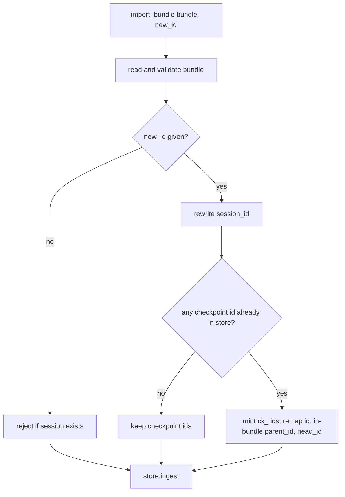

# Bundle Copy Checkpoint Ids

## Summary

`SessionBundleImporter.import_bundle(bundle, new_id=...)` rewrote only `session_id` and kept every checkpoint id. The importer itself tells callers to pass `new_id=` to import a copy, usually into the same store, but checkpoint ids are store-wide keys. In `InMemorySessionStore` the copy overwrote the original's checkpoints (the original lost its history and could no longer rewind); in `FileSessionStore` both sessions held identical ids and `store.get(id)` resolved to the original, so the copy could not rewind. The fix mints fresh checkpoint ids for a `new_id` import whenever any bundle checkpoint id already exists in the target store, remapping parent links and `head_id`. Imports into a store without those ids keep the original checkpoint ids.

## Flow chart



## Usage example

```python
from vidbyte.sessions import InMemorySessionStore, Session, SessionBundleExporter, SessionBundleImporter

store = InMemorySessionStore()
session = Session(agent, store=store)
await session.arun("one")
first = session.head

copy_id = SessionBundleImporter(store).import_bundle(SessionBundleExporter(store).export(session.id), new_id="se_copy")

session.rewind(to=first)                                   # original still owns its checkpoints
Session.resume(store, copy_id).rewind(to=store.history(copy_id)[0].id)  # copy owns fresh ids
```

## How it works

After `_rewrite_session_id`, `import_bundle` asks `_any_checkpoint_exists` whether `store.get` finds any bundle checkpoint id. If so, `_mint_checkpoint_ids` builds an old-to-new `ck_{uuid4().hex}` map and applies it to each checkpoint's `id`, to each `parent_id` that points inside the bundle, and to `meta.head_id`. Seq, order, run state, and trace payloads are unchanged. Message metadata such as `resumed_checkpoint_id` records lineage to another session's checkpoint, not a DAG link, so it is left as is.

## Files

- `vidbyte/sessions/portable.py`: collision check and id re-minting in `SessionBundleImporter`.
- `tests/test_durable_sessions.py`: same-store copy regression test for memory and file stores.
- `README.md`, `skills/sessions.md`, `skills/sdk/SKILL.md`: correct the "ids always preserved" wording.

## Risks

A copy into the same store no longer shares checkpoint ids with its source, so callers that relied on that (and on the resulting corruption) see new ids. Cross-store imports are unchanged.

## Verification

New regression test fails without the fix and passes with it; `python lint/run.py` and `python scripts/run_ci.py` pass.
