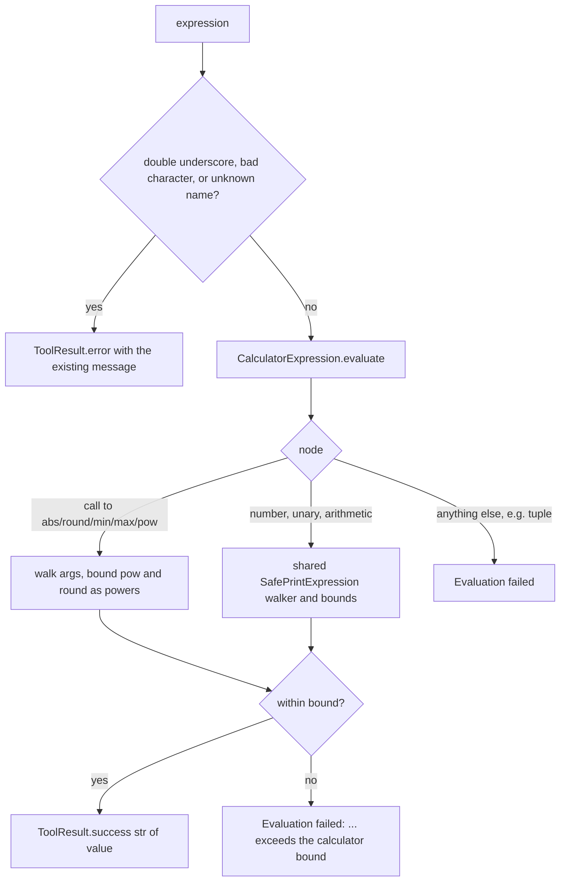

# CalculatorTool bounded evaluation

## Summary

`CalculatorTool` ran `eval` on model text inside an async tool. Nothing bounded
exponentiation, so `9**9**7` blocked the event loop for about 1.5 s, `9**9**8`
for about 54 s, and `9**9**9` or `pow(9, 9**9)` would run for hours. Run timeouts
could not fire while it ran. This change replaces `eval` with the same AST walker
and bounds that `CodeExecutionTool` uses (`docs/design/code-execution-safe-eval.md`),
extended with positional calls to the calculator's five functions.

## Flow chart



## Usage example

```python
from vidbyte.tools.builtins.calculator import CalculatorTool
from vidbyte.tools.types import ToolCall

tool = CalculatorTool()
await tool.execute(ToolCall("calculator", {"expression": "(1200*12)+350"}))  # success "14750"
await tool.execute(ToolCall("calculator", {"expression": "pow(9, 9**9)"}))   # error "Evaluation failed: exponent exceeds the calculator bound"
```

## How it works

- `CalculatorExpression` subclasses `SafePrintExpression` and only adds `ast.Call`
  handling for positional calls to `abs`, `round`, `min`, `max`, `pow`. Every other
  node goes through the shared walker, so both tools share one rule.
- `pow(a, b[, m])` is checked exactly like `a ** b`. `round(x, n)` computes
  `10 ** |n|` internally, so `n` is checked as an exponent of 10.
- Every result, including call results, passes the shared integer bit bound.
- `SafePrintExpression` gains a `BOUND_NAME` class attribute so the bound error
  names the tool; `CodeExecutionTool` behavior is unchanged.
- The pre-checks and their messages are unchanged. Top-level tuples such as
  `1,000*3` now return an error instead of `"(1, 0)"`.

## Files

- `vidbyte/tools/builtins/calculator.py`: `CalculatorExpression`, no `eval`.
- `vidbyte/tools/builtins/code_execution.py`: `BOUND_NAME` in bound messages.
- `tests/test_agent_abstractions.py`: `TestCalculatorBoundedEval`.

## Risks

- Powers with `|exponent| > 128` are now rejected even for floats (for example
  `1.01 ** 200`) and `pow(a, b, m)` with a large `b`. This matches the shared rule.

## Verification

Regression tests: normal expressions keep their results; oversized powers in
`**`, `pow(...)` and `round(...)` forms return a bound error in well under a
second; an oversized product hits the bit bound; disallowed names and tuples are
rejected. Then `python lint/run.py`, `python scripts/run_ci.py`, and CI.
