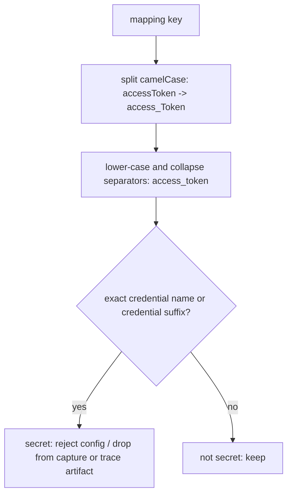

# CamelCase Credential Keys

## Summary

`CredentialKeyPolicy.is_secret_key` lower-cased a key before splitting it into
words, so camelCase credential names such as `accessToken`, `clientSecret`,
`privateKey`, `sessionToken`, and `githubToken` became `accesstoken`-style
strings that matched no credential name or suffix. Harness configs carrying
those keys were accepted and persisted, and capture scrubbing kept them. The
fix splits camelCase word boundaries before lower-casing.

## Flow chart



## Usage example

```python
from vidbyte.harnesses import HarnessSecretPolicy

HarnessSecretPolicy.is_secret_key("accessToken")  # True (was False)
HarnessSecretPolicy.is_secret_key("APIKey")       # True, still "apikey"
HarnessSecretPolicy.is_secret_key("maxTokens")    # False
```

## How it works

One `re.sub(r"([a-z0-9])([A-Z])", r"\1_\2", key)` runs before the existing
lower-case and separator normalization. All-caps runs such as `APIKey` have no
lower-to-upper boundary, so they normalize exactly as before.

## Files

- `vidbyte/lib/util/credential_keys.py`: the one-line split plus an `@intent` marker.
- `tests/test_harness_redaction.py`: camelCase regression tests.

## Risks

CamelCase keys now classify the same as their snake_case spelling, so
`nextPageToken` is scrubbed like `next_page_token` already was. Plural or
compound names such as `maxTokens` and `promptTokenCount` stay unscrubbed.

## Verification

`python lint/run.py`, `python scripts/run_ci.py`, and the new tests, which
fail on the old normalization.
