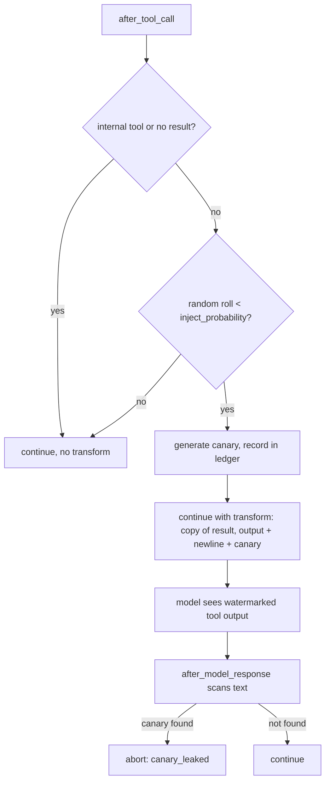

# Canary Tripwire: Inject Canaries Into the Model-Visible Tool Result

## Summary

`CanaryTripwireMiddleware` is meant to watermark tool results with a secret canary and abort the run when the model repeats it. Today `after_tool_call` only records the canary in an internal ledger and returns a plain `continue`, so the model never sees the canary and `after_model_response` can never find it: the tripwire can never fire. This change returns a `MiddlewareTransform(model_visible_tool_result=...)` carrying a copy of the tool result with the canary appended, so the model sees the watermark while the runtime keeps the raw result unchanged.

## Flow chart



## Usage example

```python
from vidbyte.middleware.builtins import CanaryTripwireMiddleware

agent = Agent(
    system_prompt="Summarize internal documents.",
    tools=[lookup_internal_doc],
    middleware=[CanaryTripwireMiddleware(inject_probability=1.0)],
)
result = agent.run("Summarize the onboarding doc.")
# If injected content drives the model to repeat the tool output verbatim,
# result.metadata["middleware_abort_reason"] == "canary_leaked".
```

## How it works

- `after_tool_call` keeps the same probability roll and canary generation. When it injects, it builds a new `ToolResult` with the same name, status, and metadata and `output = f"{raw.output}\n{canary}"`, and returns it as `model_visible_tool_result`. The frozen raw result is never mutated. Middleware transforms compose, so the append also works in middleware stacks.
- `after_model_response` scanning is unchanged.

## Files changed

- `vidbyte/middleware/builtins/canary_tripwire.py` — return the transform when injecting.
- `docs/design/security-middleware-tripwire-deputy-honeypot.md` — replace the stale "no mutation / ledger only" non-goal and requirement with the transform-based injection.
- `tests/test_security_middleware.py` — regression tests.

## Risks

- The canary is now visible text in tool output, which is the documented intent. A model may legitimately quote a tool result and trip the abort; that is the trade-off the middleware already advertises.

## Verification

- Unit: with `inject_probability=1.0` the transform's output ends with a `VIDBYTE-CANARY-` token, status and metadata are preserved, and the raw result is unchanged; no transform when the roll fails.
- Runtime: an agent whose model echoes the tool output aborts with `canary_leaked`; a model that does not echo it finishes normally.
- `python scripts/run_ci.py` and `python lint/run.py`.
