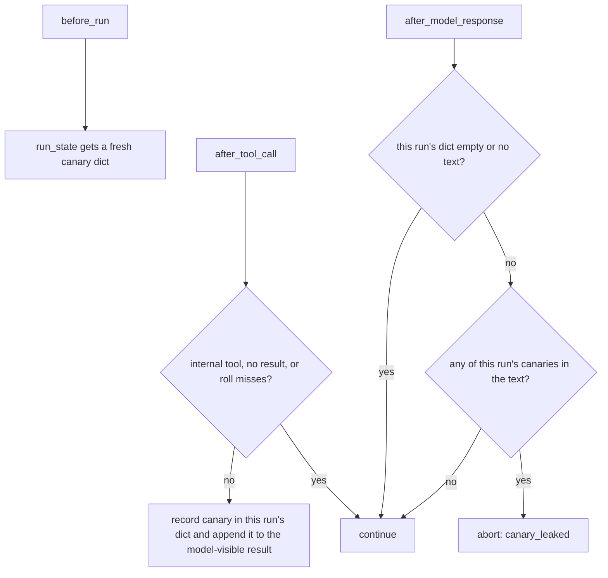

# Canary Tripwire Per-Run Ledger

## Summary

`CanaryTripwireMiddleware` kept its canary ledger on the instance and cleared it in
`before_run`. Middleware instances are shared between runs (`BaseAgent.fork()` passes
the parent's middleware list by reference, and users reuse one list across agents), so a
sibling run starting mid-flight wiped another run's outstanding canaries and that run's
later leak went undetected. This change moves the ledger into
`ctx.run_state[CanaryTripwireMiddleware]`, the same per-run pattern `CostBudgetMiddleware`
and `LoopDetectionMiddleware` already use, so each run tracks only its own canaries.

## Flow chart



## Usage example

```python
from vidbyte import BaseAgent
from vidbyte.middleware.builtins import CanaryTripwireMiddleware

parent = BaseAgent(system_prompt="...", tools=[fetch],
                   middleware=[CanaryTripwireMiddleware(inject_probability=1.0)])
a, b = parent.fork(), parent.fork()
# A sees a canary in fetch's output; B starting meanwhile no longer clears it,
# so if A's model repeats the canary, A still stops with "canary_leaked".
result_a, result_b = await asyncio.gather(a.arun("..."), b.arun("..."))
```

## How it works

- `before_run` stores a fresh `dict[str, str]` (canary to source tool) at
  `ctx.run_state[self.__class__]` instead of clearing an instance dict.
- `after_tool_call` records into that run's dict, creating it lazily when a hook is called
  without `before_run` (direct hook tests), mirroring `CostBudgetMiddleware._state_for`.
- `after_model_response` scans only that run's dict.
- The random generator stays on the instance; public behavior is otherwise unchanged.

## Files

- `vidbyte/middleware/builtins/canary_tripwire.py`: ledger moves to `run_state`.
- `tests/test_security_middleware.py`: existing canary tests read the ledger from a shared
  `run_state` dict instead of `mw._canaries`.
- `tests/test_concurrent_middleware.py`: one regression test with two interleaved runs.

## Risks

Callers driving hooks by hand must pass the same `run_state` dict for one run; the agent
runtime already does. No public API changes.

## Verification

New regression test, the offline fork repro (`a92_fork_parallel_canary.py`) pointed at
this worktree, `python lint/run.py`, and `python scripts/run_ci.py`.
