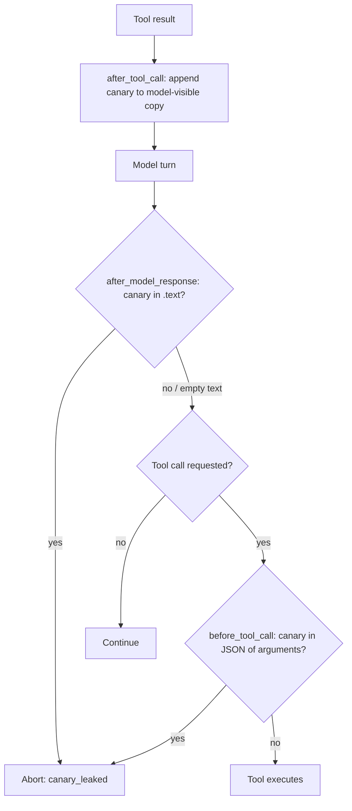

# Canary Tripwire: Scan Tool-Call Arguments

## Summary

`CanaryTripwireMiddleware` only scanned the model response's `.text` for leaked
canaries. The Anthropic, OpenAI Responses and Gemini runners leave `.text` empty on a
tool-call-only turn, so a canary exfiltrated through tool-call arguments (for example
the body of `send_email`) went undetected and the tool ran. The middleware now also
scans the normalized tool-call arguments in `before_tool_call`, so the same
`canary_leaked` abort fires on every provider before the leaking tool executes.

## Flow chart



## Usage example

```python
from vidbyte import Agent
from vidbyte.middleware.builtins import CanaryTripwireMiddleware
from vidbyte.tools.security import PermissionPolicy

agent = Agent(
    name="inbox",
    system_prompt="Triage the inbox.",
    tools=[read_inbox, send_email],
    permission_policy=PermissionPolicy.allow_all(),
    middleware=[CanaryTripwireMiddleware(inject_probability=1.0)],
)
result = agent.run("Handle new mail.")
# If the model calls send_email(body=<watermarked tool output>), the run stops with
# stop_reason == "middleware_abort" and middleware_abort_reason == "canary_leaked",
# and send_email never runs, on every provider.
```

## How it works

A new `before_tool_call` hook reads the run's canary ledger from `ctx.run_state`. When
canaries exist, it serializes `ctx.tool_call.arguments` with `json.dumps(...,
ensure_ascii=False, default=str)` and reuses `_scan_for_leaked_canaries`. Canaries are
`prefix + hex`, so they survive JSON serialization unchanged. The runtime treats an
`ABORT_RUN` from `before_tool_call` as a run abort before the tool executes, the same
path `HoneypotToolMiddleware` uses. Internal tools (`isDone`'s `final_answer`) are
scanned too, since a canary there is the same leak as one in text. `after_model_response`
is unchanged.

## Files

- `vidbyte/middleware/builtins/canary_tripwire.py`: add `before_tool_call`.
- `tests/test_security_middleware.py`: runtime regression test with an empty-text,
  tool-call-only model turn.

## Risks and open questions

- Arguments are scanned only for canaries this run issued, so false positives need a
  model to reproduce a random 16-hex-character token.

## Verification

- New test fails on `main` (no abort, `send` runs) and passes with the fix.
- `python lint/run.py` and `python scripts/run_ci.py`.
