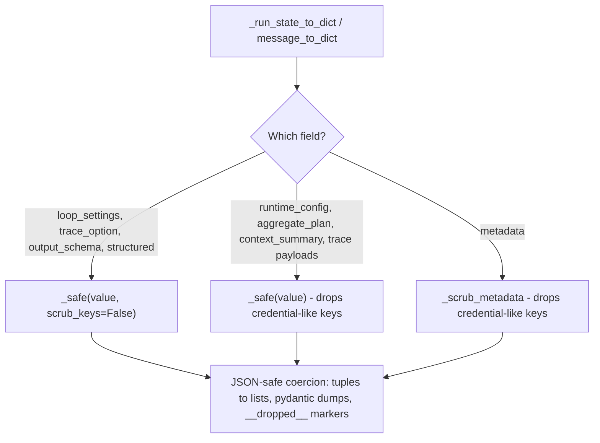

# Checkpoints keep settings names

## Summary

`SessionSerializer` runs `loop_settings`, `trace_option`, `output_schema`, and
each history message's `structured` reply through `_safe`, which deletes every
mapping key whose name contains `API_KEY`, `TOKEN`, `SECRET`, `PASSWORD`,
`CREDENTIAL`, or `AUTH`, at any depth. Inside these SDK-shaped structures the
keys are developer-chosen *names*, not credentials, so a checkpoint silently
corrupts them:

- an `output_schema` with properties `author` / `token_count` resumes with only
  `title` while `required` still lists `author` (a self-contradictory schema);
- `ToolSettings(max_calls_per_tool={"check_auth_status": 2})` resumes as `{}`,
  so the resumed agent loses a safety cap;
- a trace field `token_estimate` disappears from the resumed trace shape;
- a structured reply `{"author": "Ana", "token_count": 3}` resumes without
  those keys, while the same message's unscrubbed `content` still holds them.

The fix keeps `_safe`'s JSON-safe coercion for these four fields but turns off
its key filter there. Every other field keeps credential-key scrubbing exactly
as today.

## Flow chart



## Usage example

```python
from vidbyte import Agent
from vidbyte.agents.settings import AgentLoopSettings, ToolSettings
from vidbyte.sessions import InMemorySessionStore, Session

schema = {
    "type": "object",
    "properties": {"title": {"type": "string"}, "author": {"type": "string"}, "token_count": {"type": "integer"}},
    "required": ["title", "author"],
}
settings = AgentLoopSettings(tool_settings=ToolSettings(max_calls_per_tool={"check_auth_status": 2}))
agent = Agent(name="writer", system_prompt="Write.", output_schema=schema, agent_loop_settings=settings)

store = InMemorySessionStore()
session = Session(agent, store=store)
session.checkpoint()
resumed = Session.resume(store, session.id).agent

assert resumed.output_schema == schema  # author and token_count survive
assert resumed.agent_loop_settings.tool_settings.max_calls_per_tool == {"check_auth_status": 2}
```

## How it works

`_safe` gains a keyword-only `scrub_keys: bool = True`. When it is `False`, the
mapping branch keeps every key; the flag is passed down through lists and
pydantic dumps (`_dumped_model`) so nested data is treated the same way. All
existing call sites keep the default, so their behavior is unchanged.
`_run_state_to_dict` passes `scrub_keys=False` for `loop_settings`,
`trace_option`, and `output_schema`; `message_to_dict` passes it for
`structured`.

Why these structures cannot carry credentials as keys (`vidbyte/agents/base.py`):

- `_export_loop_settings` builds a dict from a fixed tuple of
  `AgentLoopSettings` field names, plus `tool_settings` / `tool_error_policy`
  (the constructor kwargs of `ToolSettings` / `ToolErrorPolicy`, whose only
  free-form keys are tool names in `max_calls_per_tool`) and `output_contracts`
  entries (`type`, `minimum`, `tool_name`, `cost_per_million_tokens`).
- `_export_trace_option` emits `mode`, `schema_name`, `schema_description`,
  `schema_fields` (trace field names mapped to `TraceField` dumps),
  `every_n_iterations`, `max_trace_iterations`.
- `_export_output_schema` emits `{"kind", "schema"}` or `{"kind", "name"}`,
  where `schema` is a JSON Schema whose keys are keywords and property names.
- `structured` is the parsed final answer; its full text already persists
  unscrubbed in the same message's `content`, so the key filter protects
  nothing and only corrupts the copy.

The key filter never inspected values, so it gave no protection against a
secret placed as a value in any of these structures either.

Out of scope: the substring policy itself, `metadata` scrubbing (including the
`metadata["structured"]` copy the agent adds to replies), `runtime_config`,
`aggregate_plan`, `context_summary`, and trace payload scrubbing.
`_SETTINGS_WHITELIST` becomes redundant for `loop_settings` but is left in
place to keep the change minimal.

## Files changed

- `vidbyte/sessions/serialization.py` - `scrub_keys` flag on `_safe` and
  `_dumped_model`; four call sites pass `scrub_keys=False`.
- `tests/test_durable_sessions.py` - regression tests.
- `docs/design/checkpoint-keeps-settings-names.md` - this doc.

## Risks

A developer who put a real credential as a *key name* inside a JSON schema,
trace field, or tool-cap mapping would now persist it. That is not a credible
shape: these keys are read back as names by the SDK.

## Verification

Regression tests in `tests/test_durable_sessions.py`: a serializer round trip
plus `Agent.restore` keeps schema properties `author` / `token_count`, the
`check_auth_status` tool cap, the `token_estimate` trace field, and a history
message's structured `author` / `token_count`; a metadata `api_key` is still
dropped. Then `python lint/run.py` and `python scripts/run_ci.py`.
