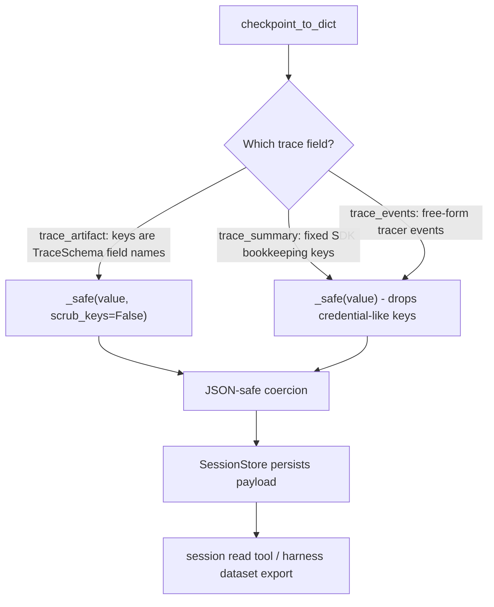

# Checkpoints keep trace artifact names

## Summary

`SessionSerializer.checkpoint_to_dict` persists a checkpoint's `trace_artifact`
through `_safe`, whose key filter deletes every mapping key containing
`API_KEY`, `TOKEN`, `SECRET`, `PASSWORD`, `CREDENTIAL`, or `AUTH`. The trace
artifact is the continual trace dict (`reply.metadata["trace"]` or
`agent.last_trace`), and its keys are exactly the field names the developer
declared in the agent's `TraceSchema`. A trace with fields `token_estimate`,
`auth_flow`, and `summary` is checkpointed as `{"summary": ...}`: two declared
fields silently vanish from the session read tool and from harness dataset
export.

PR #627 already stopped scrubbing these same trace field names inside
`trace_option`. This change does the same for `trace_artifact`: it keeps
`_safe`'s JSON-safe coercion but turns off its key filter. `trace_summary` and
`trace_events` stay key-scrubbed.

## Flow chart



## Usage example

```python
from pydantic import BaseModel

from vidbyte import Agent
from vidbyte.lib.dataclasses.trace import TraceOption
from vidbyte.sessions import FileSessionStore


class CostTrace(BaseModel):
    token_estimate: int | None = None
    auth_flow: str | None = None
    summary: str | None = None


agent = Agent(name="biller", system_prompt="Bill.", trace_option=TraceOption.continual(CostTrace, every_n_iterations=9, max_trace_iterations=1))
store = FileSessionStore(tmpdir)
session = agent.persist(store=store)
agent.run("Bill the customer.")
# The trace agent wrote {"token_estimate": 1200, "auth_flow": "oauth device code", "summary": "billed run"}.

assert store.head(session.id).trace_artifact == agent.last_trace  # all three fields survive
```

## How it works

One call site changes in `vidbyte/sessions/serialization.py`:
`"trace_artifact": self._safe(checkpoint.trace_artifact, scrub_keys=False)`.
The #627 `@intent settings-names-are-not-secrets` comment on `_safe` is
extended to list trace artifacts, and the checkpoint narration comment says
why the artifact keeps its keys.

The key filter never inspected values, so it gave no protection against a
secret written as a trace value; it only removed declared field names.

`trace_summary` comes from `ContinualTraceMiddleware._summary`, whose keys are
fixed SDK names (`mode`, `schema`, `update_count`, `error_count`,
`last_error`); none match the filter, so it stays scrubbed with no effect.
`trace_events` are free-form tracer events and stay scrubbed.

Harness export (#546): `TrajectoryCollector` still runs every exported turn,
including `trace_artifact`, through `HarnessRedactor.redact`, which scrubs
credential assignments inside string values and drops keys that exactly match
(or end in) credential names such as `api_key`, `token`, `auth`, `*_token`.
That value redaction still applies to exported trace values. Field names like
`token_estimate` and `auth_flow` are not matched by that exact-name policy, so
they now reach the export.

## Files changed

- `vidbyte/sessions/serialization.py` - `trace_artifact` passes
  `scrub_keys=False`; comments updated.
- `tests/test_durable_sessions.py` - regression tests beside
  `SettingsNamesSurviveCheckpointTests`; the portable-bundle test
  `test_export_scrubs_secret_keys_inside_trace_payloads` (#228) asserted that
  an `api_key` key inside `trace_artifact` is dropped, so its credential key
  moves to `trace_events` (still scrubbed) and it now asserts the artifact
  keeps its field names.
- `docs/design/checkpoint-keeps-trace-artifact-names.md` - this doc.

## Risks

A trace schema that declares a field literally named after a credential (for
example `api_key`) would now persist that key and its value in the session
store and in portable session bundles, which previously dropped the pair. The
`updateTrace` tool merges only declared top-level fields, so such a key can
only appear if the developer declared it, or as an undeclared subfield of a
declared OBJECT field. The harness export still applies its own key and value
redaction.

Follow-up: `docs/design/trace-artifact-precise-secret-keys.md` closes this
risk. The trace artifact now drops exact credential names such as `api_key`
while keeping field names such as `token_estimate` and `auth_flow`.

## Verification

A checkpoint whose `trace_artifact` has keys `token_estimate`, `auth_flow`,
and `summary` round-trips through `checkpoint_to_dict` / JSON /
`checkpoint_from_dict` with every key; a `trace_events` entry with an
`api_key` key is still dropped. Then `python lint/run.py` and
`python scripts/run_ci.py`.
