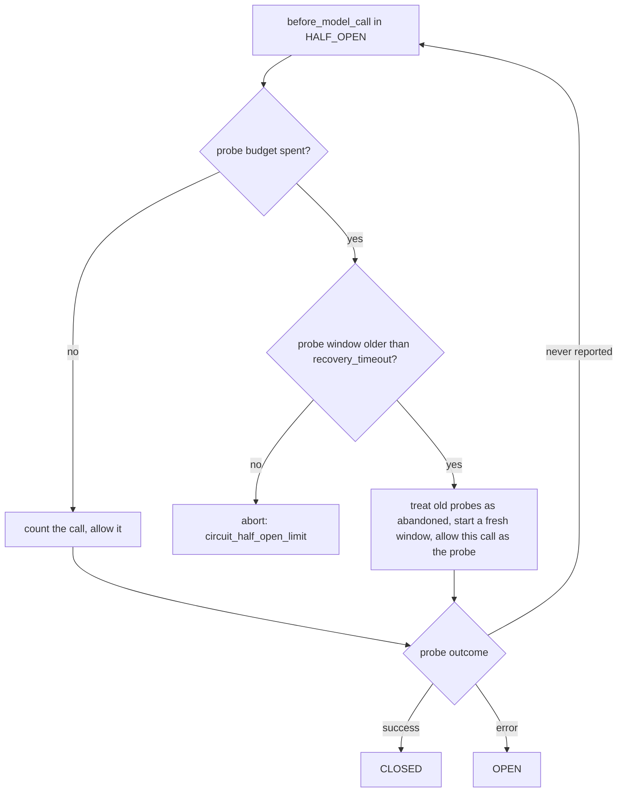

# Circuit Breaker Half-Open Probe Expiry

## Summary

`CircuitBreakerMiddleware` is shared across runs. When it moves from OPEN to HALF_OPEN it grants a probe slot, and the only ways out of HALF_OPEN are the probe reporting success (`after_model_response`, to CLOSED) or failure (`on_model_error`, to OPEN). If the probe never reports back, because the caller cancelled the run mid-call or a later middleware aborted the run after the breaker granted the slot, the probe budget stays spent and every later call is rejected with `circuit_half_open_limit` forever. This change makes an abandoned probe window expire after `recovery_timeout`, so the breaker can always try again.

## Flow chart



## Usage example

```python
from vidbyte import Agent
from vidbyte.middleware.builtins import CircuitBreakerMiddleware

breaker = CircuitBreakerMiddleware(failure_threshold=1, recovery_timeout=0.1, half_open_max_calls=1)
# Shared across runs. If a half-open probe is cancelled by asyncio.wait_for and never
# reports an outcome, a call made 0.1s or more after that probe was granted becomes a
# fresh probe instead of being rejected with "circuit_half_open_limit" forever.
agent = Agent(system_prompt="...", middleware=[breaker])
```

## How it works

- Record `_half_open_started_at` when OPEN moves to HALF_OPEN (the moment the first probe is granted).
- In `_handle_half_open_state`, when the probe budget is spent and `clock() - _half_open_started_at >= recovery_timeout`, reset the probe count to 1 (this call), move the window start to now, and allow the call.
- Clear `_half_open_started_at` in `_transition_to_open` and `_transition_to_closed`.
- Reuses `recovery_timeout` and the injectable `clock`; no new constructor parameter. All work stays under the existing lock. CLOSED and OPEN behavior, thresholds, abort reasons, and metadata keys are unchanged.

## Files

- `vidbyte/middleware/builtins/circuit_breaker.py`: the fix.
- `tests/test_new_middleware_builtins.py`: regression tests using the injectable clock.

## Risks

- A probe that is merely slow (still in flight past `recovery_timeout`) is treated as abandoned, so one extra probe may be admitted. Its outcome still resolves the state normally. This bounds probes to `half_open_max_calls` per `recovery_timeout`, which is the intended trade-off.

## Verification

- New tests: an unresolved probe still blocks callers before `recovery_timeout` elapses, a call at or after it is admitted as a fresh probe, the fresh window is bounded again, and its success closes the circuit; a failed probe that re-opens the circuit does not reuse the stale window.
- `python lint/run.py` and `python scripts/run_ci.py`.
