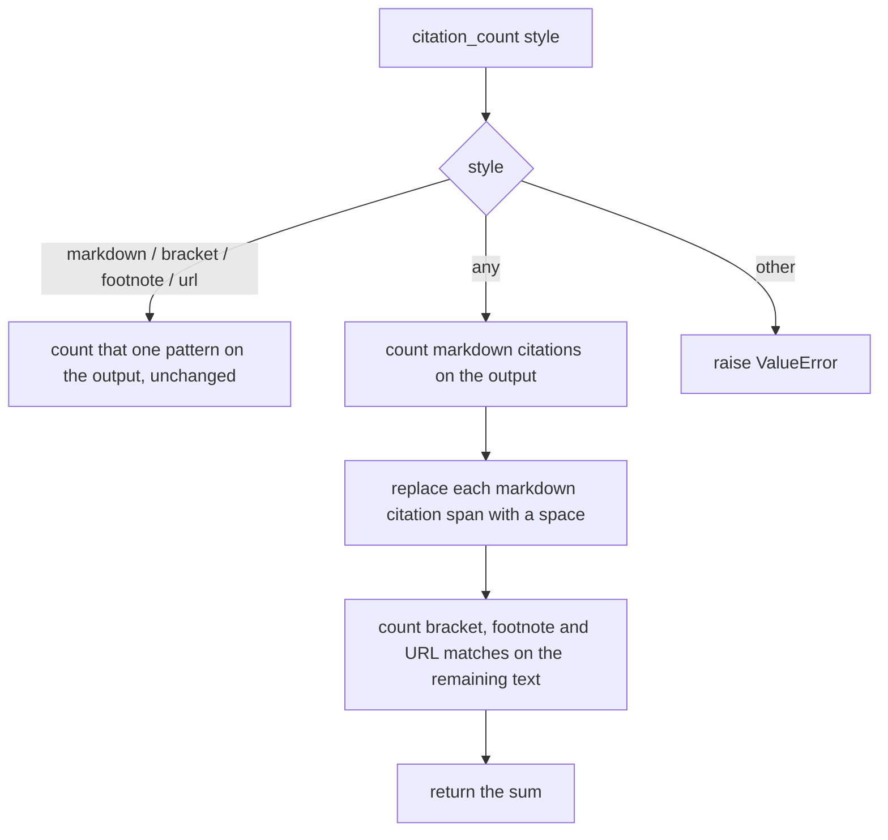

# Count a Markdown-Linked Citation Once Under Style "any"

## Summary

`OutputBehavior.citation_count("any")` added up the markdown, bracket, footnote and URL counts over the same text. A markdown citation `[label](https://...)` also contains a URL, so one linked reference counted as two, and `[1](https://...)` counted as three (its label also matches the bracket style). Requirement 17 of the output-behavior design says `citation_count` counts citation-like references for the requested style, and one markdown link is one reference. The fix counts markdown citations first, then counts the other styles on the text with those markdown spans removed.

## Flow chart



## Usage example

```python
agent = Agent(system_prompt="Answer with sources.")
agent.run("Why did rates rise?")
# Reply: "Rates rose in 2025 [Fed report](https://example.com/fed-2025)."

agent.behavior.output.citation_count("any")             # 1 (was 2)
agent.behavior.output.citation_count("any", at_most=1)  # True (was False)
agent.behavior.output.citation_count("url")             # 1, single-style counts are unchanged
```

## How it works

Only the `"any"` branch of `OutputBehavior._citation_count_for_style` changes. It computes `unlinked = _MARKDOWN_CITATION_PATTERN.sub(" ", output)`, then returns the markdown count on the full output plus the bracket, footnote and URL counts on `unlinked`. Replacing with a space keeps neighbouring words from joining. The single-style branches are untouched.

## Files changed

- `vidbyte/evals/behavior/output.py`: the `"any"` branch of `_citation_count_for_style`.
- `tests/test_agent_behavior.py`: a regression test, and the existing mixed-citation assertion now expects exactly 3 references instead of at least 4 (the old bound relied on the double count).

## Risks and open questions

- Callers that relied on the inflated `"any"` count with `at_least` bounds will see lower numbers. That was the bug, not a contract.

## Verification

- New test: one markdown link counts 1, `[1](https://...)` counts 1, and markdown link + bare URL + `[2]` + `[^3]` counts 4.
- `python lint/run.py` and `python scripts/run_ci.py` pass locally; CI checks pass on the PR.
