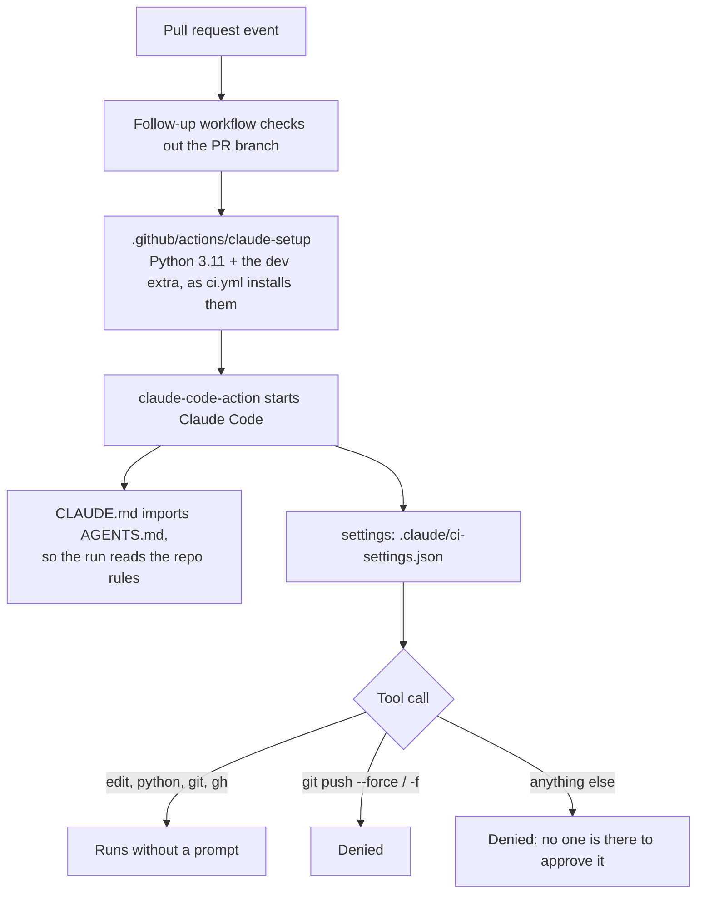

# Claude PR Agents Setup

## Summary

This change lays the groundwork for Claude Code agents that will run on this repository's pull requests in GitHub Actions: an autofix pass when a pull request opens, and review-driven fixes when a reviewer submits a review that mentions `@claude`. It adds only the repository-side prerequisites those agents need. The workflows, the agent definitions, and their prompts land in a follow-up pull request. Splitting it this way keeps this diff small and free of behavior: nothing here runs until a workflow uses it.

The account-side setup is already in place and was checked before this branch was cut. The `CLAUDE_CODE_OAUTH_TOKEN` repository secret exists, the `claude:autofixed` label exists, and the repository allows all actions.

## Flow chart



## Usage example

The follow-up workflows will use the two new files like this:

```yaml
steps:
  - uses: actions/checkout@9c091bb21b7c1c1d1991bb908d89e4e9dddfe3e0 # v7.0.0
    with:
      ref: ${{ github.event.pull_request.head.ref }}
      fetch-depth: 0
  - uses: ./.github/actions/claude-setup
  - uses: anthropics/claude-code-action@2dca132ff0e0c4094ce6048b422c6915a071210b # v1
    with:
      claude_code_oauth_token: ${{ secrets.CLAUDE_CODE_OAUTH_TOKEN }}
      settings: .claude/ci-settings.json
      prompt: "..."
      claude_args: --agent autofix-lint --model claude-opus-5-5 --effort high
```

## How it works

- **`CLAUDE.md`** holds one line, `@AGENTS.md`. Claude Code can read `AGENTS.md` by itself, but its documentation says that support can be missing in the first session after an install. A CI runner installs Claude Code fresh on every run, so every run is a first session. The import makes CI load the rules every time. Locally nothing changes, because a session that reads `CLAUDE.md` gets the same `AGENTS.md` through the import.
- **`.github/actions/claude-setup/action.yml`** is a composite action. It installs Python 3.11 and the `[dev]` extra with the same pinned `setup-python` and the same pip command as `ci.yml`. An agent can then run `python scripts/run_ci.py` on the runner before it commits. It verifies nothing by itself and is not part of the gate.
- **`.claude/ci-settings.json`** is the permission set that unattended runs start with. A headless run has no one to approve a tool call, so anything not allowed here is denied. It allows file edits, `python`, `git`, `gh pr`, `gh api`, and the subagent tool, and it denies force pushes. Claude Code automatically loads only `.claude/settings.json` and `.claude/settings.local.json`, so this file never widens what a local session may do. Only the workflow loads it, through the action's `settings` input.
- **`REPO_MAP.md`** gets a `CLAUDE.md` entry on the Root files line, plus new `.claude/` and `.github/actions/` entries. These follow the map's rule that every top-level folder is covered by a general intent description.

## Files

| Action | File | Reason |
|---|---|---|
| CREATE | `CLAUDE.md` | Makes every Claude Code run, including fresh CI installs, load `AGENTS.md` |
| CREATE | `.github/actions/claude-setup/action.yml` | Installs the toolchain the agents need to run the gate on a runner |
| CREATE | `.claude/ci-settings.json` | Sets which tools unattended agent runs may use |
| MODIFY | `REPO_MAP.md` | Maps the new root file and the two new folders |
| CREATE | `docs/design/claude-pr-agents-setup.md` | This document |

## Risks and open questions

- The composite action and the settings file have no consumer until the follow-up pull request lands. Each is a few lines and is inert until a workflow references it.
- `Bash(python *)` and `Bash(git *)` are broad. That is acceptable here: each runner is ephemeral, the action rejects triggering users without write access, and fork pull requests get no secrets. The action's own system prompt also forbids force pushes and rebases.
- `run_ci.py` does not run the Semgrep static policy, so the setup action does not install Semgrep either. Open question: should the agents run the static policy too? If yes, the follow-up adds `semgrep==1.170.1` to this action.
- The Claude GitHub App installation can't be checked from the GitHub API with a user token. Confirm it under Settings → Integrations → GitHub Apps.

## Verification

- `python scripts/run_ci.py` in a fresh Python 3.11 venv, with the dev extra installed from this worktree, exits 0.
- `action.yml` parses as YAML and declares `name`, `description`, and `runs.using: composite`. `ci-settings.json` parses as JSON.
- `ci.yml` is dispatched on this branch, the way branches here are verified while automatic triggers are disabled. The required checks `Source / Python 3.11`, `Source / Python 3.12`, and `Package` must pass.
