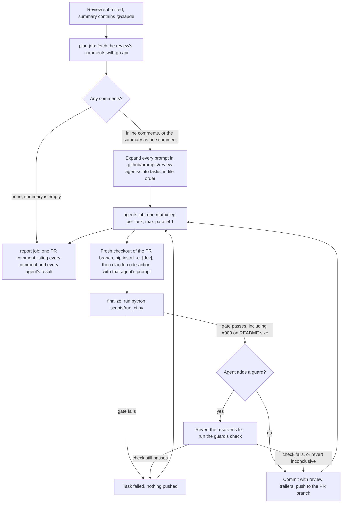

# Claude Review Agents

## Summary

When a reviewer submits a pull-request review whose summary mentions `@claude`, a workflow hands the review's comments to a fixed sequence of Claude Code agents. Each agent is one Markdown prompt. There are three: the **resolver**, which runs once for the whole review, groups the comments that depend on each other, and makes the pull request do what each comment asked, checking its own fixes for accuracy and the repository's standards and running the lint rules and tests before it finishes; the **preventer**, which runs once per comment and adds a deterministic guard, chosen from a catalog of every kind of test and every other check that runs without a model, so the same kind of comment cannot be needed again; and, last, the **notes writer**, which records what each comment taught as a two- or three-sentence note at the bottom of the README of the folder the comment points into, so the next agent in that folder reads the lesson before it starts. New lint rule A009 caps every folder README at 40,000 characters, so the notes writer must compact a folder's notes once they reach that size. Every run of every agent is its own GitHub Actions job, so each one starts in a fresh context window. Adding an agent later means adding one prompt file. The goal is the reviewer's own metric: fewer review comments over time, because each comment is fixed once and then made impossible to repeat.

This is a port of the same workflow in the CLI repository, adapted to this repository's gate, lint suite, test layout, and Placement Rules. It builds on the agent toolchain and settings from the Claude PR agents setup, so it is stacked on that pull request and lands after it.

## Flow chart



## Usage example

A reviewer leaves inline comments, then submits the review with a summary that mentions `@claude`:

```text
Inline, vidbyte/providers/client.py line 41:
  "This validates with assert, which python -O strips. Raise ConfigurationError."
Inline, vidbyte/providers/client.py line 77:
  "Same problem here."
Inline, vidbyte/tools/filesystem/read_text.py line 18:
  "This slice drops the last line of the range the caller asked for."
Review summary:
  "@claude"
```

The workflow runs five jobs in order: `resolver · review`, `preventer · c1`, `preventer · c2`, `preventer · c3`, and `readme-notes · review`. The resolver puts the first two comments in one group, because they are the same fix, keeps the third in a group of its own, fixes all three, and runs the lint rules and tests before it finishes. The pull request gets the commits and one summary comment:

```text
fix: raise typed errors in provider checks and keep the last line   Claude-Review-Agent: resolver
feat(lint): add S063 for assert statements in library code         Claude-Review-Agent: preventer
test(tools): pin read_text line ranges to include the last line    Claude-Review-Agent: preventer
docs: record review notes on asserts and line ranges               Claude-Review-Agent: readme-notes

| Comment         | resolver        | preventer                       | readme-notes    |
|-----------------|-----------------|---------------------------------|-----------------|
| client.py:41    | changed 1a2b3c4 | changed 5d6e7f8, guard verified | changed 9a0b1c2 |
| client.py:77    | changed 1a2b3c4 | no change (covered by 5d6e7f8)  | changed 9a0b1c2 |
| read_text.py:18 | changed 1a2b3c4 | changed 3c4d5e6, guard verified | changed 9a0b1c2 |
```

The first two comments teach one lesson, so the notes writer adds one note to `vidbyte/providers/README.md` for them and one to `vidbyte/tools/README.md`, the nearest README above `filesystem/`, for the third. The providers note reads:

```markdown
## Notes for agents

Mistakes that review caught in this folder, oldest first. Read them before you change anything here.

- **Validate with typed errors, never `assert`.** A provider client here checked its settings with `assert`, which Python strips under `-O`, so the check vanished from optimized runs; raise `ConfigurationError` with the field and the bad value instead. `python lint/run.py --rule S063` now fails on this mistake.
```

Adding another agent later is one file. Its order comes from its number, and its scope says what one run covers:

```markdown
---
scope: comment
---
# Review Docs Updater

## Goal
...
```

saved as `.github/prompts/review-agents/40-docs-updater.md`.

## How it works

**Trigger.** The workflow listens for `pull_request_review: submitted`. It runs only when the review body contains `@claude` and the pull request comes from this repository, not a fork. `workflow_dispatch` takes a PR number and a review ID, so a review can be processed again by hand. The SDK's verification workflows are dispatch-only for now; this one is not a verification workflow, so it keeps its review trigger.

**Plan.** A script fetches the review, its inline comments, and the parent comment of any reply through `gh api`, so no model decides which comments exist. If the review has no inline comments, its summary becomes the one comment. No model plans the tasks either: a script expands every agent over the units its scope names.

**Agents.** Every `NN-name.md` file in `.github/prompts/review-agents/` is an agent, run in file-number order. Its frontmatter sets `scope`: `review` (one run for the whole review, the default) or `comment` (one run per comment). It can also set `guard: true`. A matrix with `max-parallel: 1` runs the tasks one at a time, and each leg checks the branch out again and reinstalls the dev extra, so it sees every earlier push and the pull request's own dependencies. Each leg installs its toolchain with `.github/actions/claude-setup`, which installs Python 3.11 and the dev extra exactly as `ci.yml` does, plus Semgrep at the pin `static-policy.yml` uses.

- The resolver has `scope: review`. It sees every comment at once, groups the ones that depend on each other, and fixes the groups in order in one session, so no two sessions ever edit the same code toward different ends. Before it finishes, it checks each fix against its comment, checks its diff against the four principles and the Placement Rules in `AGENTS.md` and the folder notes, and runs `python lint/run.py`, `python -m compileall -q vidbyte`, the three structural checkers in `scripts/`, the Semgrep static policy, the pytest files it touched, the whole suite, and `python scripts/run_ci.py`.
- The preventer has `scope: comment` and `guard: true`. Its prompt carries a catalog of prevention mechanisms, grouped by rung of the prevention ladder and written for this repository's tools: types and APIs that make a mistake impossible; static checks, from a Ruff code selected in `lint/core/ruff.py` to a new rule in `lint/rules/`, the banned-API table, a `scripts/check_*.py` checker, or a Semgrep policy; every kind of pytest test from unit to mutation, each explained in two or three sentences; and process gates. All of them run without a model.
- The notes writer has `scope: review`, so it runs once, after every other task, and sees every comment at once: comments that teach the same lesson share one note, as a "same problem here" reply should.

**Reading the rules.** Every run reads `AGENTS.md` twice over. `CLAUDE.md` imports it at session start, and the action restores `CLAUDE.md` from the base branch, so a pull request cannot remove it. Each prompt's first instruction also tells the agent to read `AGENTS.md`, `REPO_MAP.md`, and the README of each folder it will touch before changing anything, and repeats that `docs/` is opaque. `tests/test_review_agents.py` fails if an agent prompt's first instruction stops naming `AGENTS.md`.

**Notes.** For each comment on a file, the `prompt` step walks up from the file's folder to the nearest `README.md` below the repository root and names it in the assignment as the comment's "Folder README". The root README is never chosen, because it is the package's PyPI description, and the notes writer never creates a README. It appends one bullet per lesson to a closing `## Notes for agents` section: two or three plain English sentences, the first in bold stating the rule, the rest saying what went wrong, what to do instead, and why, optionally naming the command of a guard that now enforces it. A note carries no link, URL, comment ID, or pull request number, because it has to stand on its own. The resolver and preventer read the same section first, and `AGENTS.md` tells every other agent to read a folder's README to the end.

**README ceiling.** New lint rule A009 fails any tracked folder README longer than its ceiling. The ceiling is 40,000 characters, with two exceptions that the rule names in code. The root `README.md` is exempt: it is the PyPI long description, at about 79,000 characters, and the notes writer never touches it. `vidbyte/agents/codex/README.md` and `vidbyte/providers/README.md` were already longer than 40,000 characters when the rule began, so each keeps a fixed legacy ceiling, 65,000 and 55,000, that leaves room for notes and may only be lowered. When a note pushes a README past its ceiling, the notes writer compacts only the notes section, dropping notes a guard now enforces, then merging notes that teach the same lesson, then shortening the oldest, until the file is at or under the compaction target, 10,000 characters below the ceiling, which A009's message names. If it skips that, the gate fails and nothing is pushed. The rule's ID is A009, not the CLI's C008, because each repository numbers its own rules and A009 is the next free ID in this suite's architecture family.

**Finalize.** Agents only edit files; the workflow commits and pushes. After an agent finishes, the finalize step does these things in order:

1. It puts back the config paths the action restored from the base branch, such as `.claude/` and `CLAUDE.md`, so they are never committed.
2. It runs `python scripts/run_ci.py`, the canonical gate `AGENTS.md` names, and pushes nothing if the gate fails. That gate runs the source stage and the package stage; it does not run Semgrep, which stays in `static-policy.yml`.
3. It folds any commits the agent made into one commit, using the agent's title and trailers that name the review, the agent, the unit, and the comment IDs.
4. For a `guard: true` agent, it reverts the earlier commits whose trailers name this comment, which is the resolver's one commit for the review, and runs the agent's `check_command`. If the check still passes there, the guard would not have caught the comment, so the commit is dropped.
5. It pushes to the PR branch with `CLAUDE_REVIEW_PUSH_TOKEN` when that secret is set, otherwise with `GITHUB_TOKEN`.

**Report.** The last job downloads every task's result and posts one pull-request comment with a row per comment and a column per agent. The resolver's own summary lists its groups. A task with no result counts as failed, so a skipped agent cannot look like success. The report job fails when any task failed.

**Tokens.** Every Claude step authenticates with the repository secret `CLAUDE_CODE_OAUTH_TOKEN`. The action gets `github_token: ${{ github.token }}` instead of exchanging OIDC for the Claude GitHub App token. The App's installation token expires after one hour, and a long agent run plus the gate can outlast it before the push. Pushes from `GITHUB_TOKEN` do not trigger other workflows; that matters only once `ci.yml` runs on pull requests again, and `CLAUDE_REVIEW_PUSH_TOKEN` exists for that case.

**Where the helper's records live.** The Placement Rules put every new dataclass in `vidbyte/lib/dataclasses/` and every new enum in `vidbyte/lib/enums/`. The review helper's records stay in `scripts/review_agents/review_data.py` instead, and the module's header says why: the helpers run on the plan and report jobs with the runner's own Python, where the SDK is not installed, they never ship in the wheel, and `scripts/run_ci.py` already keeps its own dataclasses the same way. The module is not named `models.py`, which the rules forbid.

## Files

| File | Change |
|---|---|
| `.github/workflows/claude-review-agents.yml` | New workflow with three jobs: plan (no model), agents (a matrix), report. |
| `.github/prompts/review-agents/10-resolver.md` | New. The comment resolver: groups the review's comments, fixes them, and verifies the fixes with this repository's lint rules, checkers, static policy, and tests. |
| `.github/prompts/review-agents/20-preventer.md` | New. The recurrence preventer, built on the prevention ladder, with a catalog of every deterministic prevention mechanism this repository's tools support. |
| `.github/prompts/review-agents/30-readme-notes.md` | New. The notes writer, which runs last and records each comment's lesson in its folder README, in plain sentences without links. |
| `lint/rules/a009_readme_size_limit.py`, `lint/core/registry.py`, `lint/baseline.json`, `lint/README.md`, `lint/rules/README.md` | New rule A009: every tracked folder README holds at most 40,000 characters, or its legacy ceiling. Its baseline is zero. |
| `scripts/review_agents/` | New helper package run by the workflow: `run.py` (subcommands `collect`, `plan`, `prompt`, `finalize`, `report`, `check`) plus one module each for the records, the registry, GitHub reads, planning, prompts, folder READMEs, git, finalize, and the report. |
| `tests/test_review_agents.py` | New offline pytest spec of the helpers and of A009, including finalize against a temporary git repository and a local bare remote, and one test per requirement the reviewer set for the prompts. The gate runs it with the rest of the suite. |
| `.github/actions/claude-setup/action.yml` | Also installs `semgrep==1.170.1` with pipx, so the resolver can run the static policy without changing the SDK's own dependency versions. |
| `.claude/ci-settings.json` | Denies every `git push`, allows `semgrep`, and removes the `gh` allowances, because the workflow pushes and the prompt carries all GitHub context. |
| `AGENTS.md` | One paragraph: read a folder's README to the end before changing the folder, including its notes, and what A009 bounds. |
| `REPO_MAP.md` | Describes the new prompts folder, workflow, and helper package, and the setup and settings changes. |

## Risks and open questions

- This pull request is stacked on the Claude PR agents setup pull request and must merge after it; it then retargets to `main`.
- The helper's records stay in `scripts/` rather than `vidbyte/lib/`, as described above. If the Placement Rules should name `scripts/` as an exception, that is a one-line change to `AGENTS.md`.
- Two folder READMEs keep legacy ceilings above 40,000 characters. Trimming them is a change of its own; each entry in `LEGACY_CEILINGS` should be lowered as its file shrinks and deleted once it fits.
- The gate the workflow runs does not include Semgrep, because `scripts/run_ci.py` does not. The resolver runs the static policy itself, but a change that only Semgrep rejects can still be pushed and then fail `static-policy.yml`.
- The resolver handles the whole review in one session, so a very long review fills one context window instead of several small ones. Its prompt has it group the comments first and fix one group at a time; if long reviews prove a problem, its `scope` can move to `comment`.
- The bite check reverts the resolver's one commit, which undoes every comment's fix at once, not only the preventer's own. The preventer is told to confirm that its check fails because of its own comment's defect, and the report shows the verdict.
- The bite check is inconclusive when the revert conflicts, or when no resolver commit exists for the comment. The guard is then pushed with that verdict in the report, not rejected.
- GitHub keeps only one pending run per concurrency group, so a third `@claude` review submitted while the first still runs replaces the second in the queue. Reviews without `@claude` use a separate group and never displace one.
- Tasks run one at a time, and each runs the full gate, including the package stage's build and clean install, so a review with many comments takes a long time.
- `GITHUB_TOKEN` cannot push changes under `.github/workflows/`, so finalize refuses those edits and says so in the report.
- This pull request does not reply in each review thread or resolve the threads. The summary comment carries the results for now.
- A comment on a file with no README between it and the root, such as anything under `.github/` or a root file like `pyproject.toml`, gets no note.
- The SDK's verification workflows are dispatch-only, so commits the workflow pushes are not checked by CI until someone dispatches `ci.yml` and `static-policy.yml` on the branch.

## Verification

- `python scripts/run_ci.py` in a fresh Python 3.11 virtualenv with the dev extra installed from this worktree, which runs `tests/test_review_agents.py` with the rest of the suite and A009 with the rest of the lint rules.
- `python scripts/review_agents/run.py check --agents-dir .github/prompts/review-agents`.
- `actionlint` on the new workflow, and the Semgrep static policy.
- `ci.yml` and `static-policy.yml` dispatched on this branch.
- A live run on a throwaway draft pull request based on this branch, with three planted mistakes: two instances of one problem in one file and one independent problem in another. Its review has three inline comments, one of them "Same problem here.", and a summary that mentions `@claude`. The `pull_request_review` event runs the workflow from the pull request's merge ref, so this works before the workflow reaches `main`. The run must show two groups in the resolver's summary, fixes for all three comments, each guard verified or covered, notes without links, and a summary comment that matches the pushed commits.
