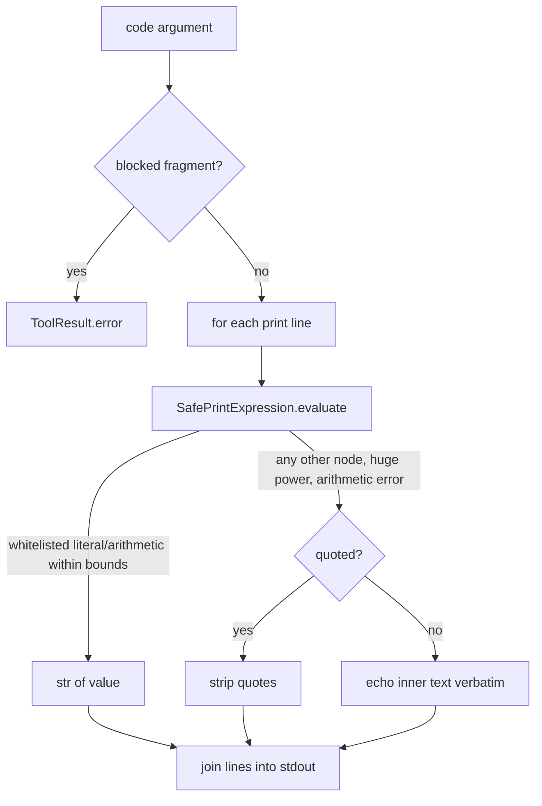

# CodeExecutionTool safe print evaluation

## Summary

`CodeExecutionTool` advertises a "safe simulated runtime", but it evaluated
non-literal `print(...)` arguments with `eval(inner, {"__builtins__": {}}, {})`.
Emptying builtins is not a sandbox: attribute traversal stays reachable (for
example `print((1).__class__.__name__)` returned `int`), so model text, including
prompt-injected tool output, reached a real `eval`. This change replaces `eval`
with a small AST whitelist walker and bounds exponentiation.

## Flow chart



## Usage example

```python
from vidbyte.tools.builtins.code_execution import CodeExecutionTool
from vidbyte.tools.types import ToolCall

tool = CodeExecutionTool()
await tool.execute(ToolCall("code_execution", {"code": "print((2 + 3) * 4)"}))  # output "20"
await tool.execute(ToolCall("code_execution", {"code": "print((1).real)"}))      # output "(1).real" (not evaluated)
await tool.execute(ToolCall("code_execution", {"code": "print(9 ** 9 ** 9)"}))   # output "9 ** 9 ** 9" (bounded)
```

## How it works

- `SafePrintExpression.evaluate` parses the argument with `ast.parse(mode="eval")`
  and interprets only: `int`/`float`/`str` constants, unary `+`/`-` on numbers,
  and `+ - * / // % **` on numbers, plus `str + str`. Every other node (attribute,
  call, name, subscript, comprehension, lambda, containers) raises.
- Powers are rejected when `|exponent| > MAX_PRINT_EXPONENT` (128) or the integer
  result could exceed `MAX_PRINT_INT_BITS` (4096); every integer result is also
  checked against that bit bound, so a model cannot pin the CPU.
- Unevaluable input keeps the tool's existing behavior: the inner text is echoed
  (quoted text has its quotes stripped). No new error surface is added.
- The blocked-fragment path now uses `ToolResult.error`; it previously passed an
  `error=` keyword `ToolResult` does not accept, which raised `TypeError`.
- Spec name and parameter are unchanged; descriptions are expanded for S025.

## Files

- `vidbyte/tools/builtins/code_execution.py`: walker, bounds, header.
- `tests/test_agent_abstractions.py`: `TestCodeExecutionSafeEval` regressions.

## Risks

- Prints that previously evaluated non-arithmetic expressions (for example
  `print(1, 2)` or `print([1, 2])`) now echo their text. These were never
  documented behavior. `CalculatorTool` is out of scope and unchanged.

## Verification

Regression tests: arithmetic and string prints evaluate; attribute access and
calls echo unevaluated; names and string repetition echo; huge exponents echo
in under a second; blocked fragments return a tool error. Then
`python lint/run.py`, `python -m pytest -q -x`, and CI.
