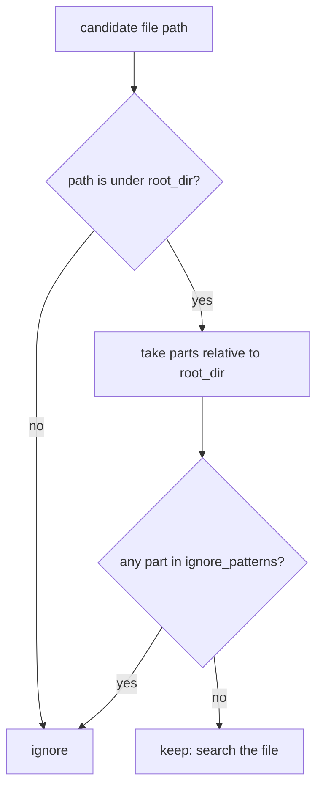

# Code search: apply ignore patterns relative to the root

## Summary

`BaseCodeSearchTool.should_ignore` checked every part of the absolute path against
the ignore list (`.git`, `node_modules`, `__pycache__`, `.venv`, `venv`). A search
root that itself sits inside one of those directories, such as
`project/node_modules/left-pad` or `project/venv/lib/site-packages/requests`,
therefore ignored every file, and `GrepTool`, `GlobTool`, and `SemanticSearchTool`
returned "No matches found." / "No files matched." The fix checks only the path
parts below the configured root, so the root's own ancestors no longer count while
ignored directories inside the root are still skipped.

## Flow chart



## Usage example

```python
from vidbyte.tools.builtins.code_search import GlobTool, GrepTool
from vidbyte.tools.types import ToolCall

root = "project/node_modules/left-pad"
await GrepTool(root).execute(ToolCall("grep", {"pattern": "TODO"}))
# -> src/index.js:1: // TODO pad   (root/node_modules/inner/x.js still ignored)
await GlobTool(root).execute(ToolCall("glob", {"pattern": "**/*.js"}))
# -> src/index.js
```

## How it works

`should_ignore` computes `path.relative_to(self.root_dir)` and matches only those
parts. The comparison is lexical (no extra `resolve()`), so it matches what both
callers pass: `iter_files` hands over `rglob` paths under the already resolved root,
and `GlobTool` hands over resolved paths. A path outside the root returns `True`;
both callers already drop such paths, so behavior there is unchanged.

## Files changed

- `vidbyte/tools/builtins/code_search/base.py`: `should_ignore` body (inherited by
  grep, glob, and semantic search).
- `tests/test_code_search_tools.py`: one regression test.

## Risks

None expected beyond the intended change: ignore matching below the root is
identical to before.

## Verification

New test builds roots under `node_modules` and `venv` ancestors, asserts
`src/index.js` is found by grep and glob, and that `<root>/node_modules/inner/x.js`
is still ignored. It fails before the fix and passes after. Then `python lint/run.py`,
`python scripts/run_ci.py`, and the dispatched `ci.yml` / `static-policy.yml` runs.
