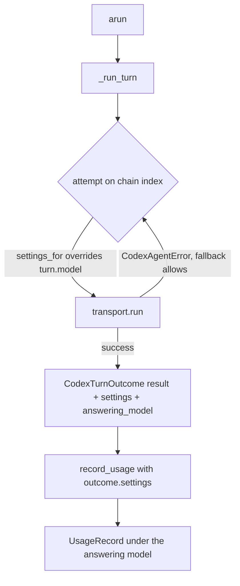

# Codex fallback usage model

## Summary

When a Codex turn fails on the primary model and a fallback model answers,
`CodexHarnessAgent.arun` still filed the turn's usage under the primary model,
because it passed `self.settings.codex` to `CodexMetricsTranslator`. The reply's
`answering_model` named the backup, so usage and metadata disagreed and the turn
was priced at the primary model's rates (about 25x overbilled for
`gpt-5.6-sol` -> `gpt-5.6-luna`). The fix carries the answering attempt's
resolved settings out of the attempt loop and records usage with them.

## Flow chart



## Usage example

```python
agent = CodexHarnessAgent(
    CodexHarnessAgentSettings(
        name="codex-agent",
        codex=CodexAgentSettings(thread=CodexThreadSettings(model="gpt-5.6-sol")),
        fallback=AgentFallbackSettings(
            models=["gpt-5.6-luna"], fallback_on=(CodexAgentError,)
        ),
    )
)
reply = await agent.arun(CodexRunInput.text("go"))  # primary fails, luna answers
assert reply.metadata["answering_model"] == "gpt-5.6-luna"
assert agent.get_usage().calls[0].model == "gpt-5.6-luna"  # was gpt-5.6-sol
```

## How it works

- `CodexTurnOutcome` (vidbyte/lib/dataclasses/codex.py) gains a required,
  validated `settings: CodexAgentSettings` field: the settings the answering
  attempt actually ran with.
- `_run_turn` already computes those settings per attempt via
  `CodexFallbackCoordinator.settings_for`; it now returns them on the outcome.
- `arun` passes `outcome.settings` to `CodexUsageTranslationRequest`.

Without a fallback chain `settings_for` returns the primary settings unchanged,
so single-model runs record exactly as before. Sandbox, approval, fallback
policy, and `_recordable_usage` (including the custom `model_provider` skip,
which `settings_for` does not alter) are untouched.

## Files

- vidbyte/lib/dataclasses/codex.py: `CodexTurnOutcome.settings`.
- vidbyte/agents/codex/agent.py: return and use the attempt settings.
- tests/test_codex_failure_recovery.py: regression test.

## Risks

`CodexTurnOutcome` is constructed only in `_run_turn`, so the new required
field breaks no other caller.

## Verification

A regression test runs a fallback turn that reports usage and asserts the
recorded model is the backup and the cost equals the same usage run directly
on the backup model. Then `python lint/run.py`, the Codex test files, and the
full suite.
