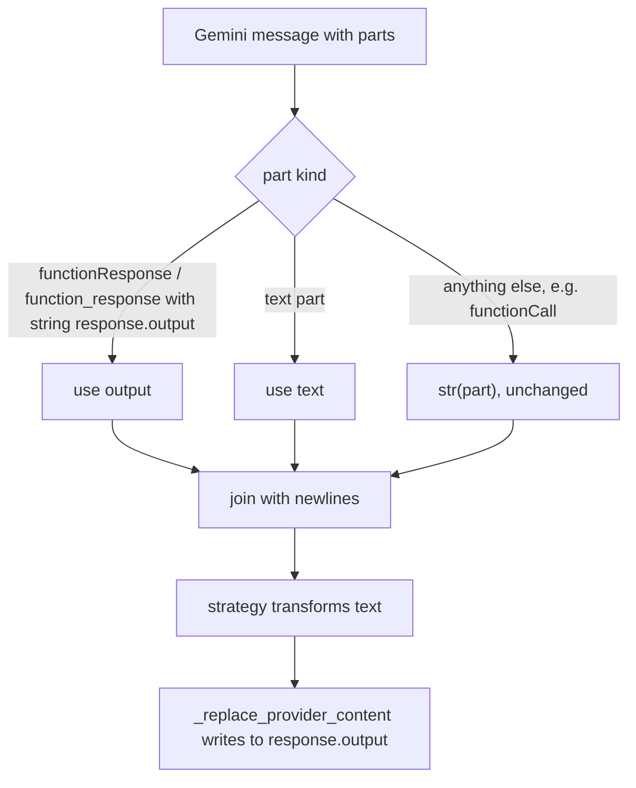

# Compaction: extract Gemini part text

## Summary

Content-rewriting compaction strategies (`head_tail_tool_preview`, `scrub_bloat`, `clear_tool_results_except`, `tool_output_sliding_window`) read a provider message's text, transform it, and write it back. For Gemini, write-back stores the text in `functionResponse.response.output`, but extraction returned the Python repr of each whole part. Head/tail previews were cut from the repr, and bloat scrubbing saw one escaped line, so it left the tool output untouched. Extraction now reads the same text that write-back writes.

## Flow chart



## Usage example

```python
from vidbyte.middleware.builtins import MessageHistoryCompactionMiddleware

# On a Gemini agent the preview now starts with the tool's real output ("# a.py\ndef f()...")
# instead of "{'functionResponse': {'name': 'read_file', ...".
middleware = MessageHistoryCompactionMiddleware.head_tail_tool_preview(head_chars=50, tail_chars=20)
```

## How it works

In `ContextCompactionEngine._provider_message_content`, the `parts` branch now extracts text per part, mirroring the Anthropic branch: a `functionResponse` (or `function_response`) part contributes its `response["output"]` when that is a string, a `text` part contributes its text, and every other part keeps today's `str(part)`. `_replace_provider_content` and the strategies are unchanged.

## Files

- `vidbyte/middleware/compaction/engine.py`: the extraction fix.
- `tests/test_deterministic_compaction_middleware.py`: Gemini regression tests for head/tail preview and bloat scrubbing.

## Risks

- A function response whose `output` is not a string still falls back to the part repr, as before.
- A Gemini message with several functionResponse parts still gets the same rewritten text in each part; that write-back behaviour predates this change and is out of scope.

## Verification

New engine-level tests fail on `main` and pass with the fix; the full compaction suite, `python lint/run.py`, and `python scripts/run_ci.py` pass.
