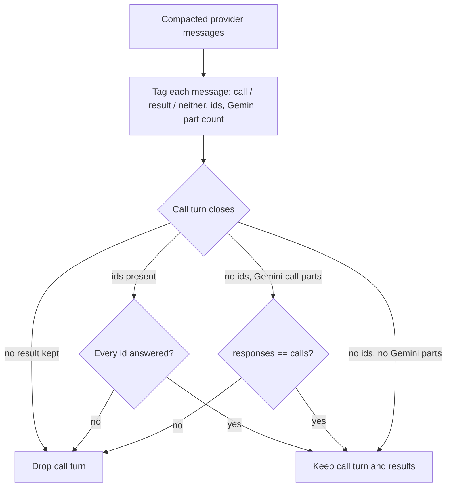

# Compaction: drop partly answered Gemini function-call turns

## Summary

History compaction can remove some, but not all, of the `functionResponse` turns that answer one parallel Gemini `functionCall` turn. The pairing repair in `ContextCompactionEngine` uses tool-call ids to require that a call turn is fully answered, but Gemini parts carry no ids, so it kept a 3-call turn with 1 response and Gemini rejected the request. The fix counts function-call parts and function-response parts for id-less call turns and drops the call turn with its results unless the counts match.

## Flow chart



## Usage example

```python
from vidbyte.context.compaction import CompactionMode, ContextCompactionEngine

history = (
    {"role": "user", "parts": [{"text": "audit"}]},
    {"role": "model", "parts": [{"functionCall": {"name": "read_file", "args": {"i": i}}} for i in (1, 2, 3)]},
    *({"role": "user", "parts": [{"functionResponse": {"name": "read_file", "response": {"output": f"out{i}"}}}]} for i in (1, 2, 3)),
)
after, _ = await ContextCompactionEngine().compact_provider_messages(history, mode=CompactionMode.REMOVE_LAST_N_TOOL_CALLS, options={"n": 2})
# The 3-call turn and its one surviving response are both dropped: after == (history[0],)
```

## How it works

`_tool_pairing_tags` adds a third tag field: the number of `functionCall`/`function_call` parts on a call turn, or `functionResponse`/`function_response` parts on a result. `_repair_tool_pairing` sums the response parts it keeps after a call turn and, when the call turn has no ids but has function-call parts, drops the turn and its results unless the sums are equal. Id-based pairing (OpenAI, Anthropic) is unchanged, and result-only orphans are still dropped.

## Files

- `vidbyte/middleware/compaction/engine.py`
- `tests/test_deterministic_compaction_middleware.py`

## Risks

A Gemini call turn answered by a non-Gemini result shape would now be dropped; the SDK never produces that mix.

## Verification

New regression tests for a partly answered and a fully answered Gemini turn; `python lint/run.py` and `python scripts/run_ci.py`.
