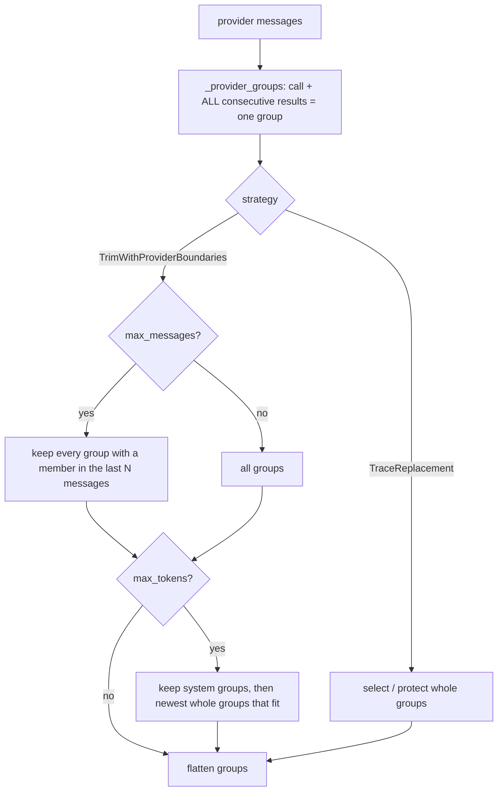

# Compaction Keeps Parallel Tool Turns Whole

## Summary

With parallel tool calling (OpenAI/DeepSeek/xAI chat format), one assistant `tool_calls` message is followed by several `role="tool"` replies. `_provider_groups` paired a call with only its first result, and `TrimWithProviderBoundariesCompaction` repaired only adjacent records and then token-trimmed without boundaries. As a result, `TraceReplacementCompactionMiddleware.keep_recent_tail` / `replace_oldest_n_iterations` and `trim_with_provider_boundaries` could emit orphaned tool results or unanswered `tool_call` ids, and providers reject those with HTTP 400. This change treats a tool call plus all of its consecutive results as one group, and both trim paths keep or drop whole groups.

## Flow chart



## Usage example

```python
from vidbyte.middleware.builtins import MessageHistoryCompactionMiddleware, TraceReplacementCompactionMiddleware

trim = MessageHistoryCompactionMiddleware.trim_with_provider_boundaries(max_messages=3, max_tokens=800)
tail = TraceReplacementCompactionMiddleware.keep_recent_tail(keep_last_groups=2, artifact={"goal": "ship it"})
# Neither one splits [assistant(tool_calls=[c1, c2]), tool(c1), tool(c2)] any more.
```

## How it works / files

- `vidbyte/middleware/compaction/strategies.py`
  - `_provider_groups` absorbs every consecutive `tool_result` after a `tool_call`.
  - `TrimWithProviderBoundariesCompaction.compact` selects groups by membership in the last `max_messages` records. It then token-trims whole groups (system groups first, then newest-first), which replaces `_boundary_repairs` and the per-message `TrimToTokenBudgetCompaction` pass.
- Tests: `tests/test_deterministic_compaction_middleware.py` and `tests/test_trace_replacement_compaction.py` add a parallel-turn history. They assert there are no orphaned results and no unanswered call ids.

Intentionally naive strategies (`keep_last`, `trim_to_token_budget`, and others) are unchanged.

## Risks

`max_messages` / `max_tokens` can now keep slightly more messages, or drop slightly more, than a per-message trim would. That is the point: a valid transcript beats an exact count.

## Verification

- The new tests fail on `main` and pass with the fix.
- `python scripts/run_ci.py --stage source` passes locally.
- The CI and Static policy workflows are dispatched on the PR branch.
