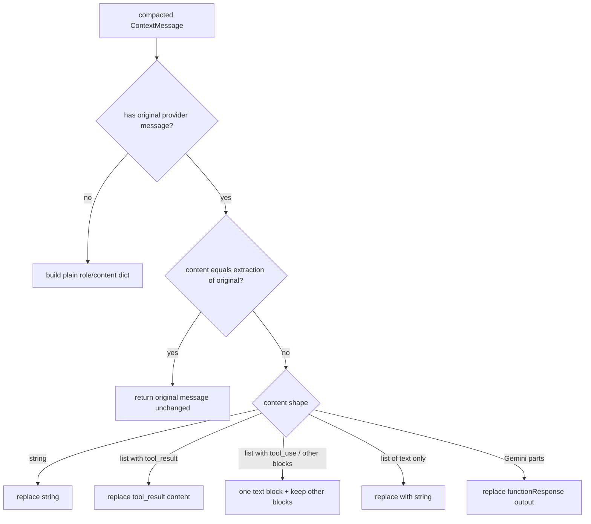

# Compaction: preserve provider messages a strategy did not change

## Summary

`ContextCompactionEngine.compact_provider_messages` rebuilt every provider message from its flattened text after a strategy ran, even messages the strategy never touched. OpenAI-chat assistant tool-call turns (`content: None`) came back with a repr string as content, and Anthropic assistant turns had their `tool_use` blocks flattened into a string, so the next `tool_result` referenced a missing id and the provider rejected every compacted request (HTTP 400). The fix returns untouched messages as-is and never flattens structured blocks when a message is rewritten.

## Flow chart



## Usage example

```python
from vidbyte.context.compaction import CompactionMode, ContextCompactionEngine

history = (
    {"role": "user", "content": "go"},
    {"role": "assistant", "content": [{"type": "tool_use", "id": "t1", "name": "read_file", "input": {}}]},
    {"role": "user", "content": [{"type": "tool_result", "tool_use_id": "t1", "content": "x" * 5000}]},
)
after, _ = await ContextCompactionEngine().compact_provider_messages(
    history, mode=CompactionMode.HEAD_TAIL_TOOL_PREVIEW, options={"head_chars": 40, "tail_chars": 10}
)
assert after[1] == history[1]  # tool_use block intact; only the tool_result was shortened
```

## How it works

- `_context_message_to_provider` compares the compacted `ContextMessage.content` with `_provider_message_content(original)` (the same extraction used on the way in) and returns a copy of the original when they match.
- `_replace_provider_content`, for list content without a `tool_result` block, keeps every non-text block (e.g. `tool_use`) and replaces the text blocks with a single text block; text-only lists still collapse to a string as before. Tool-result and Gemini `functionResponse` handling are unchanged.

## Files

- `vidbyte/middleware/compaction/engine.py`
- `tests/test_deterministic_compaction_middleware.py` (regression tests for OpenAI-chat `content: None` turns and Anthropic `tool_use` blocks under `head_tail_tool_preview` and `keep_last`)

## Risks

- A strategy that rewrites an Anthropic assistant turn containing `tool_use` blocks gets one text block holding the strategy's text; the extracted text includes a rendering of the non-text blocks, so the text may echo them. Calls stay valid, which is what providers require.

## Verification

New regression tests fail on `main` and pass with the fix; `python scripts/run_ci.py`, `python lint/run.py`, then CI (`ci.yml`, `static-policy.yml`).
