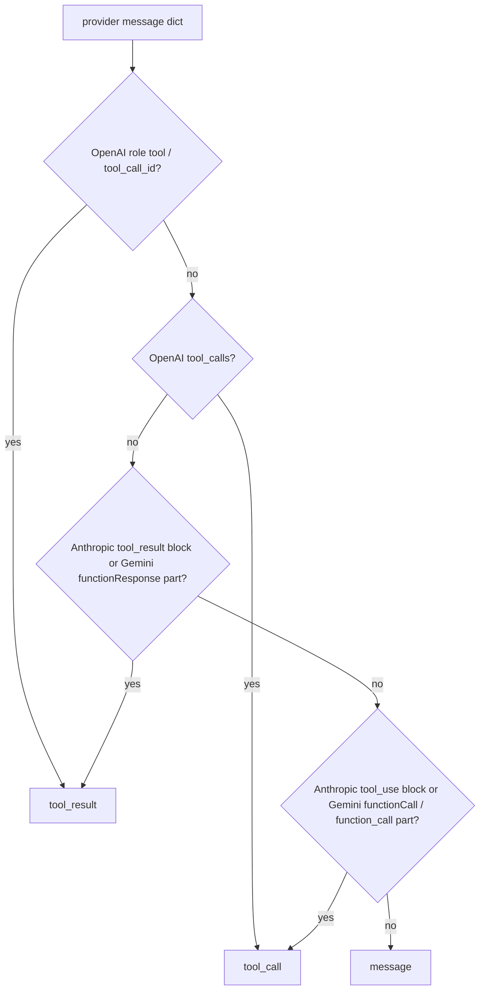

# Compaction Tool-Call Kind for Every Provider Shape

## Summary

`ContextCompactionEngine._provider_message_kind` recognized tool results in the OpenAI, Anthropic and Gemini shapes, but recognized tool calls only in the OpenAI shape (`tool_calls`). Anthropic assistant turns with `tool_use` blocks and Gemini turns with `functionCall` parts were classified as plain `"message"`. Kind-aware strategies then pruned them wrongly. For example, `salience_score_eviction` ranked Anthropic calls above their own results, evicted the results, and tool-pairing repair then dropped the orphaned calls, which left no tool context at all. This change classifies those turns as `"tool_call"`.

## Flow chart



## Usage example

```python
from vidbyte.context.compaction import CompactionMode, ContextCompactionEngine

history = (
    {"role": "user", "content": "audit"},
    {"role": "assistant", "content": [{"type": "tool_use", "id": "t1", "name": "read_file", "input": {}}]},
    {"role": "user", "content": [{"type": "tool_result", "tool_use_id": "t1", "content": "out1"}]},
    {"role": "assistant", "content": [{"type": "tool_use", "id": "t2", "name": "read_file", "input": {}}]},
    {"role": "user", "content": [{"type": "tool_result", "tool_use_id": "t2", "content": "out2"}]},
)
after, _ = await ContextCompactionEngine().compact_provider_messages(
    history, mode=CompactionMode.SALIENCE_SCORE_EVICTION, options={"max_messages": 4}
)
# after keeps the user prompt plus the newest tool_use/tool_result pair, as it does for OpenAI.
```

## How it works

Two checks are added after the existing result checks, so a message that carries tool results is still a `tool_result`. They mirror the call detection already used by `_tool_pairing_tags` and `call_signature.py`, including Gemini's snake_case `function_call`.

## Files changed

- `vidbyte/middleware/compaction/engine.py`: the two new checks with an `@intent tool-call-kind-covers-every-provider-shape` marker.
- `tests/test_deterministic_compaction_middleware.py`: salience eviction across all three shapes, and `remove_all_tool_calls` on a Gemini `functionCall` turn.

## Risks

Strategies that treat `tool_call` differently from `message` (salience scoring, provider-boundary grouping, remove-all and percentage removal, dedupe) now act on Anthropic and Gemini calls as they already did on OpenAI calls. That is the intended behavior. No strategy, content extraction or repair logic changes.

## Verification

The new tests fail on the old classifier and pass with the fix. The full compaction suite, `python lint/run.py` and `python scripts/run_ci.py` all pass.
