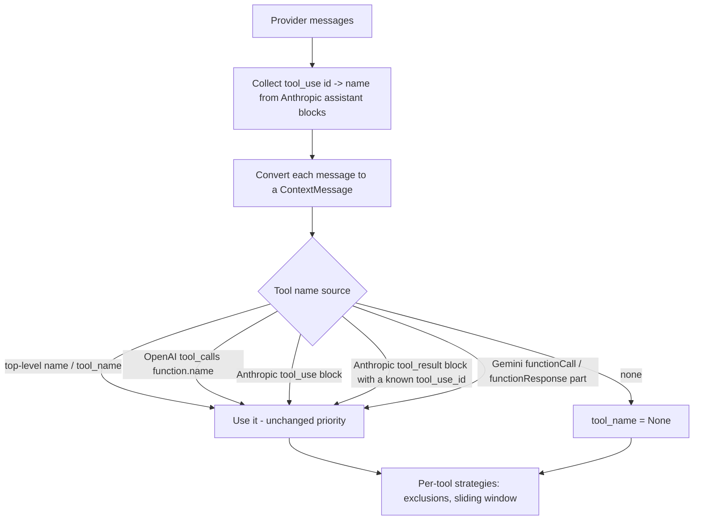

# Compaction: resolve Anthropic and Gemini tool names

## Summary

`ContextCompactionEngine` records each provider message's tool name in `ContextMessage.metadata["tool_name"]`, but `_provider_tool_name` only reads OpenAI shapes (a top-level `name`/`tool_name` or `tool_calls[*].function.name`). Every Anthropic and Gemini tool message therefore gets `tool_name=None`, so the per-tool strategies misbehave on those histories: `clear_tool_results_except(exclude_tools=["read_file"])` clears the excluded `read_file` results anyway, and `tool_output_sliding_window` counts every tool as one. The fix reads tool names from Anthropic `tool_use` blocks, from Gemini `functionCall`/`functionResponse` parts, and from Anthropic `tool_result` blocks through the id of the matching `tool_use` block.

## Flow chart



## Usage example

```python
from vidbyte.context.compaction import CompactionMode, ContextCompactionEngine

history = (
    {"role": "user", "content": "audit"},
    {"role": "assistant", "content": [{"type": "tool_use", "id": "t1", "name": "read_file", "input": {}}]},
    {"role": "user", "content": [{"type": "tool_result", "tool_use_id": "t1", "content": "file body"}]},
    {"role": "assistant", "content": [{"type": "tool_use", "id": "t2", "name": "web_search", "input": {}}]},
    {"role": "user", "content": [{"type": "tool_result", "tool_use_id": "t2", "content": "search body"}]},
)
after, _ = await ContextCompactionEngine().compact_provider_messages(
    history, mode=CompactionMode.TOOL_RESULT_CLEARING_WITH_EXCLUSIONS, options={"exclude_tools": ["read_file"]}
)
# after[2] keeps "file body"; after[4] holds "[tool result cleared by compaction]".
```

## How it works

`compact_provider_messages` and `to_context_messages` (used by the context-compaction middleware) first build one map from Anthropic `tool_use` block id to tool name across the whole history, then pass it into `_provider_to_context_message`. That method keeps `_provider_tool_name` (top-level `name`/`tool_name`, then OpenAI `tool_calls`) unchanged and first; only when it finds nothing does a new `_provider_block_tool_name` read the first Anthropic `tool_use` block name, the name mapped from the first `tool_result` block's `tool_use_id`, or the first Gemini `functionCall`/`function_call`/`functionResponse`/`function_response` part name. OpenAI behaviour is unchanged.

## Files

- `vidbyte/middleware/compaction/engine.py`
- `tests/test_deterministic_compaction_middleware.py`

## Risks

A single message carrying results from several different tools still gets one name (its first resolvable block or part), the same limit that OpenAI `tool_calls` turns already have; compaction works per message. `_provider_message_content` is not touched, so this does not overlap the concurrent Gemini part-text fix.

## Verification

New regression tests: Anthropic-shaped and Gemini-shaped histories with `read_file` and `web_search`, compacted with `TOOL_RESULT_CLEARING_WITH_EXCLUSIONS` excluding `read_file`, keep the `read_file` result and clear the `web_search` result, matching the OpenAI shape. Then `python lint/run.py` and `python scripts/run_ci.py`.
