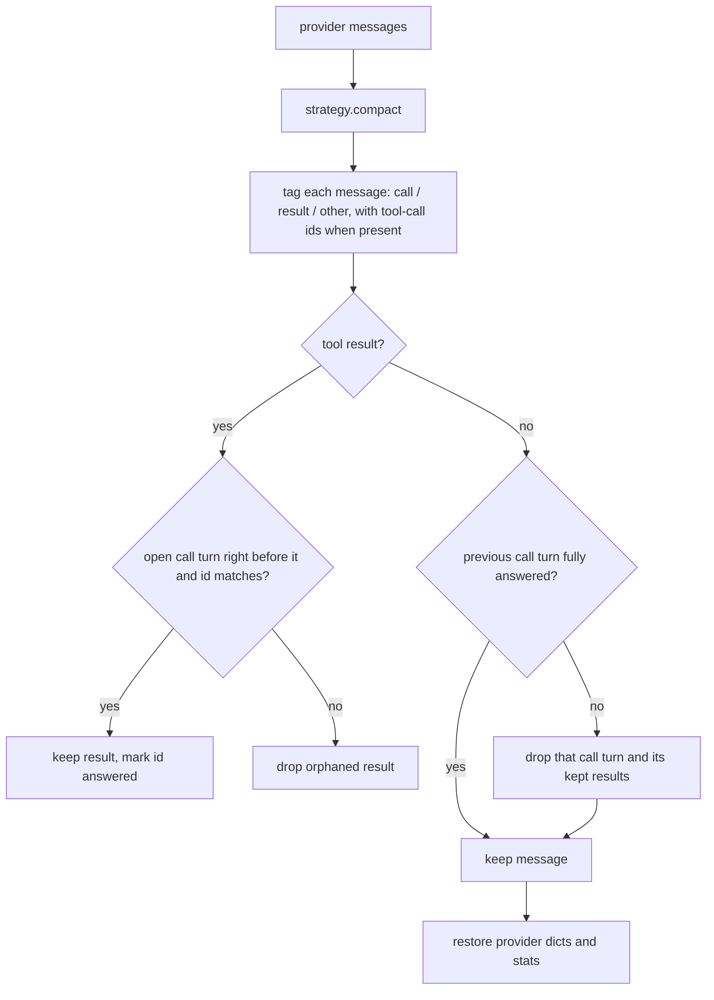

# Compaction Tool-Pairing Repair

## Summary

Message-selecting compaction strategies (`keep_last`, `trim_to_token_budget`, `remove_last_n_tool_calls`, `remove_tool_call_percentage`, `salience_score_eviction`, `query_relevance_filter`) pick individual messages. They often keep a tool result whose assistant tool-call turn was dropped, or keep a tool-call turn without all of its results. OpenAI-compatible APIs and Anthropic reject such a transcript with HTTP 400, so the agent run fails. This change adds one repair pass to `ContextCompactionEngine.compact_provider_messages` so that no strategy can hand the provider a broken call/result pairing.

## Flow chart



## Usage example

```python
from vidbyte.middleware.builtins import MessageHistoryCompactionMiddleware

# keep_last(3) may cut through a tool-call turn; the provider now receives a valid transcript.
middleware = MessageHistoryCompactionMiddleware.keep_last(3)
agent = Agent(system_prompt="...", tools=tools, middleware=(middleware,))
agent.run("read the three files and summarize them")
```

## How it works

- `_tool_pairing_tags` tags each compacted message as a tool call (OpenAI `tool_calls`, Anthropic `tool_use` blocks, Gemini `functionCall` parts), a tool result (`kind == "tool_result"`), or neither. It records the call or result ids (`tool_calls[].id` / `tool_call_id`, `tool_use.id` / `tool_result.tool_use_id`) when every entry has one, and `None` otherwise.
- `_repair_tool_pairing` walks the messages once. It keeps a result only when it directly follows a call turn and, when ids are known, its id is one of that turn's unanswered ids. When ids are missing, it falls back to adjacency, the same rule `_provider_groups` uses. Once the call turn ends, the turn and the results kept for it are dropped unless every call id was answered, or, without ids, unless at least one result followed.
- Valid transcripts pass through unchanged. Strategy selection logic is untouched.

## Files

- `vidbyte/middleware/compaction/engine.py`: the repair call plus two helpers.
- `tests/test_context_compaction_middleware.py`: regression tests. One existing fixture that relied on orphaned tool results now uses a valid transcript.

## Risks

- A strategy that produced an invalid transcript now drops a few more messages than before. This is intended, because the provider would have rejected that request.
- Assistant messages with an empty or `None` `tool_calls` are not treated as calls, so they are never dropped.

## Verification

Regression tests cover keep_last, trim_to_token_budget, and remove_last_n_tool_calls on sequential and parallel OpenAI-chat histories. They check that no tool result is orphaned and that every tool_call id is answered. Further tests cover the middleware path and confirm that valid OpenAI, Anthropic, and Gemini transcripts are kept whole. The full gate runs with `python scripts/run_ci.py` and `python lint/run.py`.
