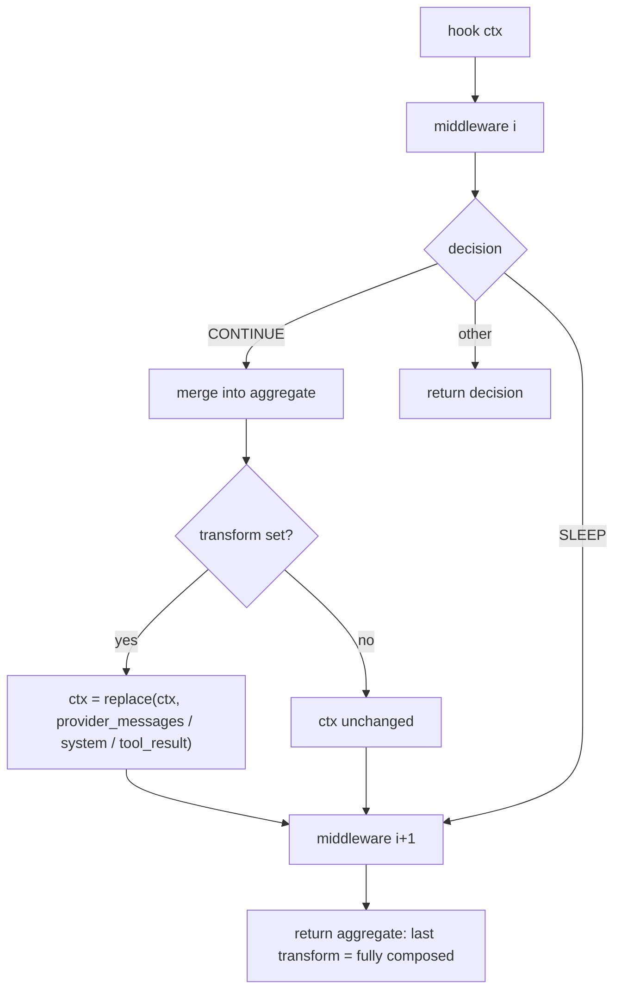

# Compose Stacked Middleware Transforms

## Summary

`MiddlewarePipeline._run` handed every middleware for a hook the same original
`MiddlewareContext`, then merged transforms with "later fields override earlier
fields". Because each later middleware computed its transform from the
untransformed context, the earlier middleware's work was silently discarded.
Stacking compaction middleware (as the README recommends) therefore applied only
the last one: `[truncate(120), scrub_bloat()]` lost the truncation, and
`[trim_with_provider_boundaries(4), clear_tool_results_except()]` lost the trim.
The fix threads each continue-transform into the context the next middleware
sees, so the stack composes and the existing merge yields the composed result.

## Flow chart



## Usage example

```python
from vidbyte import Agent
from vidbyte.middleware.builtins import MessageHistoryCompactionMiddleware, ToolResultCompactionMiddleware

agent = Agent(
    name="analyst",
    system_prompt="Investigate the logs.",
    provider="openai",
    model_name="gpt-4.1",
    tools=[read_log],
    middleware=[
        # Both now apply, in order: trim first, then clear the surviving tool results.
        MessageHistoryCompactionMiddleware.trim_with_provider_boundaries(max_messages=4),
        MessageHistoryCompactionMiddleware.clear_tool_results_except(),
        # Scrub bloat, then truncate the scrubbed output.
        ToolResultCompactionMiddleware.scrub_bloat(),
        ToolResultCompactionMiddleware.truncate(max_chars=120),
    ],
)
```

## How it works

After a middleware returns `CONTINUE` with a transform, `_run` calls a new
`_apply_transform(ctx, transform)` that uses `dataclasses.replace` to set
`provider_messages`, `system`, and `tool_result` (from
`model_visible_tool_result`) for whichever fields the transform set. The next
middleware reads that context. Decision and metadata merging are unchanged, so
the aggregate's "later wins" fields now hold the composed output. A single
middleware, a transform-free stack, and non-continue decisions behave exactly as
before. `run_state` is passed through by reference, so per-run state is shared
as today.

## Files

- `vidbyte/middleware/pipeline.py`: thread transforms into the next middleware's context.
- `tests/test_context_compaction_middleware.py`: regression test for stacked
  provider-message and tool-result compactions.

## Risks

- Middleware placed after a tool-result transform now sees the model-visible
  result instead of the raw one. Builtin transforms (compaction engine, loop
  detection) preserve `status` and `metadata`, so `ToolErrorPolicyMiddleware`
  still sees error status and error metadata. Loop detection hashes the visible
  output, which is deterministic per raw output, so repeat counting is unchanged.
- The runtime keeps the raw `ToolResult` it passed in; only the hook-local
  context changes.

## Verification

- New test fails on `main` and passes with the fix.
- `python scripts/run_ci.py --stage source` locally; CI `ci.yml` and
  `static-policy.yml` dispatched on the branch.
