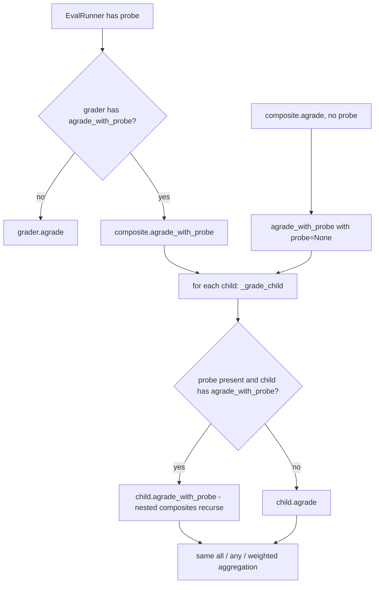

# Composite graders forward the run probe

## Summary

`EvalRunner` passes the run's `RunProbe` to a grader only when that grader has `agrade_with_probe`. `AllOfGrader`, `AnyOfGrader` and `WeightedGrader` had only `agrade`, and they called `agrade` on every child. A `PredicateGrader` inside a composite therefore never got the probe and always failed. Because of this, the common eval "the answer mentions X AND the agent used tool Y" could not pass. `AllOf` and `AnyOf` failed. `Weighted` scored the predicate 0 and could still clear its threshold, so it showed a false green. Each composite now has an `agrade_with_probe` that hands the probe to every child that accepts it. Nested composites forward it the same way.

## Flow chart



## Usage example

```python
used_search = PredicateGrader(lambda p: any(c.tool_name == "search" for c in p.tool_calls), name="used_search")
grader = AllOfGrader([ContainsGrader(), used_search])
suite = EvalSuite(name="qa", cases=(EvalCase(prompt="Capital of France?", expected="Paris", grader=grader),))
result = await EvalRunner(agent).arun(suite)
assert result.results[0].grader_result.passed  # the predicate now sees the real run probe
```

## How it works

A module helper `_grade_child(grader, case, actual, probe)` calls `grader.agrade_with_probe(case, actual, probe)` when the probe is set and the child has that method. Otherwise it calls `grader.agrade(case, actual)`. Each composite's aggregation moves into a new `agrade_with_probe(case, actual, probe)` that grades children through the helper. `agrade` calls it with `probe=None`, so the aggregation math lives in one place and behavior without a probe is unchanged. `EvalTemplateRegistry.build_grader` and the built-in templates return plain graders or `AllOfGrader`, so template-built graders are covered without extra changes.

## Files

- `vidbyte/evals/graders/composite.py`: adds `_grade_child` and an `agrade_with_probe` to each composite. `agrade` now routes through it.
- `tests/test_evals.py`: adds regression tests.

## Risks

A child that has `agrade_with_probe` now receives the probe inside a composite instead of being graded through `agrade`. That is the intended contract. When no probe is present, nothing changes.

## Verification

Run the new tests, `python lint/run.py` and `python scripts/run_ci.py`. The repro `a112_composite_predicate.py` should print `ok` on every line, with AllOf at score 1.0 and Weighted at score 1.0.
