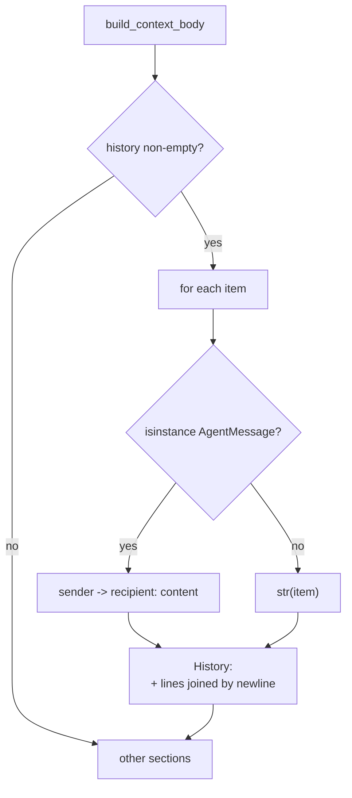

# Context History Renders Content

## Summary

`BaseContext.build_context_body` rendered each `history` entry with `str(item)`. BaseAgent passes its prior
replies (`AgentMessage`) as history, and that body lands in the system prompt of every later run. Since
`AgentMessage` has no `__str__`, each entry was its full dataclass repr, including reply metadata
(`tool_calls`, `iteration_outputs` with raw tool outputs, `usage_rollup`, ...). One run with two 5,000-char
tool outputs grew the next run's system prompt from 836 to 23,316 chars, and it keeps growing per run.
This change renders an `AgentMessage` as one conversational line without metadata.

## Flow chart



## Usage example

```python
from vidbyte.lib.dataclasses import AgentMessage
from vidbyte.lib.dataclasses.context import BaseContext

reply = AgentMessage(sender="r", recipient="orchestrator", content="short answer",
                     metadata={"iteration_outputs": ["x" * 5000]})
print(BaseContext(history=(reply, "plain note")).build_context_body())
# History:
# r -> orchestrator: short answer
# plain note
```

## How it works

A module-level helper `_format_history_item` in `vidbyte/lib/dataclasses/context.py` returns
`f"{sender} -> {recipient}: {content}"` for `AgentMessage` and `str(item)` for anything else (`history` is
typed `Sequence[object]`). `AgentMessage` is imported from `vidbyte.lib.dataclasses.agents`, which only
imports `vidbyte.lib.errors` at runtime, so there is no import cycle and no layer violation.

Unchanged: what goes into history, every other section, and user-prompt recording.

## Files

- `vidbyte/lib/dataclasses/context.py`: helper plus the one-line call-site change.
- `tests/test_context_dataclasses.py`: two focused tests.

## Risks

- Anything that relied on metadata appearing in the prompt history loses it. That was never intended
  (it dates from PR #17, when metadata was tiny); tool results remain in the current run's own transcript.
- No existing test asserted the repr-based history text.

## Verification

Targeted tests in `tests/test_context_dataclasses.py`, `python lint/run.py`, `python scripts/run_ci.py`,
then the CI and static-policy workflows on the PR.
