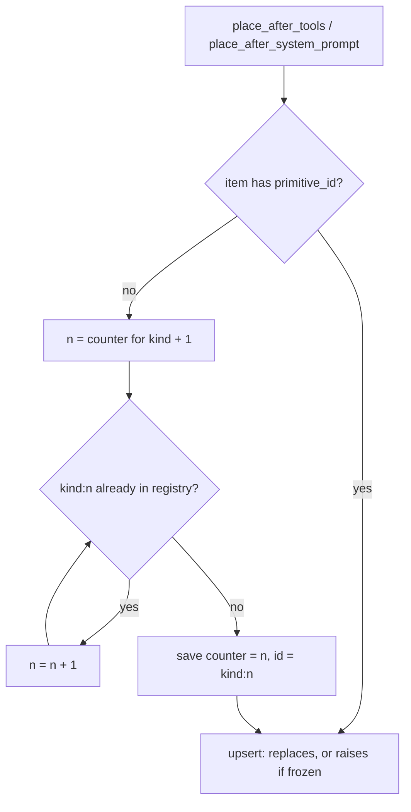

# Context Manager Generated Ids Skip Taken Ids

## Summary

`ContextManager.place_after_system_prompt()` and `place_after_tools()` mint a
`<kind>:<n>` id when an item arrives without one. The per-kind counter never
looked at the registry, so a generated id could equal an id that a builtin note
tool (reflexion, trajectory checkpoint, CoT events, reasoning) or a caller had
already written in the same shape. The fresh item then silently replaced that
note, or raised `ValueError` when the existing note was frozen. The generator
now advances its counter past every id already in the registry, so a generated
id never overwrites anything.

## Flow chart



## Usage example

```python
from vidbyte import ContextManager
from vidbyte.context.primitives import ReflexionContextItem

manager = ContextManager()
# The reflexion tool wrote the model's own note during an earlier run.
manager.upsert(ReflexionContextItem(primitive_id="reflexion:1", critique="model", correction_plan="plan"))
manager.set_frozen("reflexion:1", True)

# Developer code adds a reviewer note without minting an id.
new_id = manager.place_after_tools(
    ReflexionContextItem(primitive_id="", critique="be concise", correction_plan="shorter answers")
)
assert new_id == "reflexion:2"  # the model's note is untouched and nothing raises
```

## How it works

`_generate_primitive_id` keeps its per-kind counter but loops while
`f"{kind}:{n}"` is in `self._registry`, then stores the final counter. This
mirrors `vidbyte/tools/builtins/_note_ids.py::next_free_counter`, kept local
because `vidbyte/context/` must not import from `vidbyte/tools/`. Explicit-id
upserts are unchanged: they still replace, and frozen explicit ids still raise.

## Files changed

- `vidbyte/context/manager.py`: skip taken ids in `_generate_primitive_id`.
- `tests/test_context_primitives_registry.py`: regression tests for a taken id
  and a frozen taken id.

## Risks

Generated ids for a kind can now skip numbers when explicit ids occupy them.
Nothing relies on generated ids being contiguous.

## Verification

New unit tests, `python lint/run.py`, `python scripts/run_ci.py`, and the
external probe `a293_place_after_tools_id_collision.py` printing `BAD total 0`.
