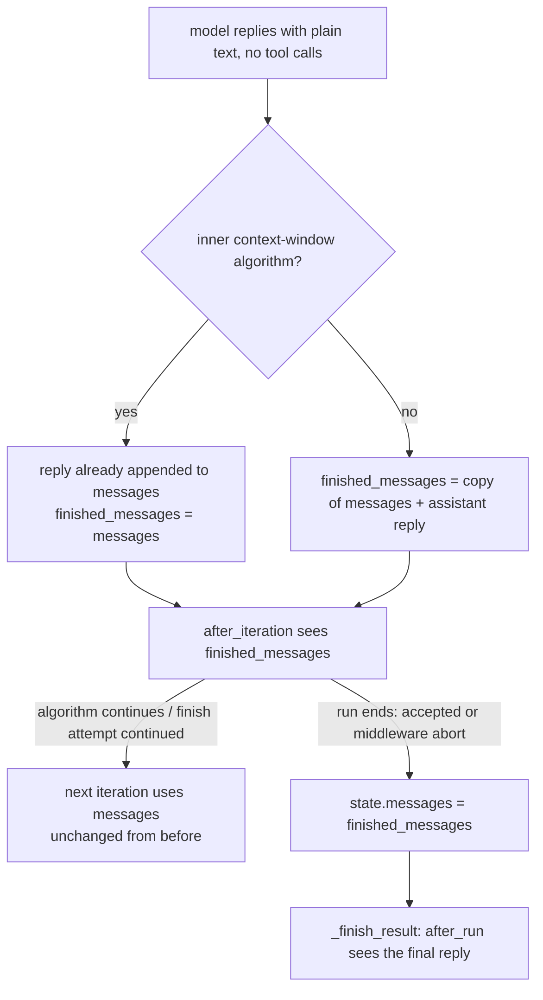

# Continual Trace Sees the Final Text Reply

## Summary

PR #622 gave the `after_iteration` and `after_run` middleware contexts the run's
live provider messages, so the continual trace sees the user prompt, tool calls
and tool results. One gap remained: when a run ends with a plain-text reply (no
`isDone` call), that reply was never added to `messages`, so the trace agent
recorded `current_status` and the outcome blind to how the run actually ended.
Real models usually finish with plain text, so this was the common path. This
change shows the accepted final reply to those two hooks as an assistant
message, without changing anything sent to the model.

## Flow chart



## Usage example

```python
from vidbyte import Agent, TraceOption
from vidbyte.trace.continual import ActionTrace

agent = Agent(
    name="incident",
    system_prompt="Incident.",
    tools=[inspect],
    trace_option=TraceOption.continual(ActionTrace, every_n_iterations=1, max_trace_iterations=1),
)
reply = agent.run("Why is lb-2 failing?")
# The model calls inspect(host="lb-2"), then replies in plain text:
#   "RESOLVED: rotated the expired TLS cert on lb-2"
# The trace agent's "Provider messages:" section now ends with
#   {"role": "assistant", "content": "RESOLVED: rotated the expired TLS cert on lb-2"}
# so agent.last_trace records the real outcome.
```

## How it works

In `_arun_once`'s plain-text finish branch (`vidbyte/agents/runtime.py`):

- Build `finished_messages`: the live `messages` list itself when an inner
  context-window algorithm is active (that path already appends the reply), or
  otherwise a new list `[*messages, assistant reply]`.
- Pass `finished_messages` to the `after_iteration` hook.
- Only on the paths that end the run (accepted finish or middleware abort), set
  `state.messages = finished_messages` right before `_finish_result`, so
  `after_run` sees it too.

Why a copy instead of appending to `messages`: the default (no algorithm) path
already appends the reply only *after* `_continue_finish_attempt`, and
`JevRuntime`'s continuation appends its feedback inside that call. Appending
earlier would reorder what a Jev continuation sends the model. Why not render
`ctx.model_response` in the trace middleware instead: on tool-call finishes
(`isDone`) the response's tool call is already in `messages`, so the trace would
have to tell the two cases apart to avoid rendering it twice; the runtime knows
which branch it is in and the reply uses the same provider-message form as the
rest of the conversation.

## Reuse paths of `messages` checked

- Inner context-window algorithm continuation: `finished_messages is messages`,
  identical to before.
- `_continue_finish_attempt` (base returns False; `JevRuntime` appends feedback
  via its continuation): still receives `messages`, then the reply is appended
  after it exactly as before. The copy is discarded on `continue`.
- `_after_tool_iteration` (`JevRuntime` compute checkpoint): only on the
  tool-call path, untouched.
- Output-contract rejection and `max_tokens` stop: run before this point,
  untouched.
- Model fallback: replaces `messages`/`state.messages` before the next model
  call; the finish branch reads the current list.
- Algorithms calling `_arun_once` directly (reflexion, independent critic,
  prosecutor/defender/judge, multi-provider grader): each call extracts a fresh
  `messages` from options; `state.messages` is only read by `_finish_result`.
- `_middleware_context` copies each message into a tuple, so hooks cannot
  mutate either list.

## Files changed

- `vidbyte/agents/runtime.py`: `finished_messages` in the plain-text finish branch.
- `tests/test_continual_trace.py`: regression tests.

## Risks and open questions

- Other after-hook middleware now sees one extra trailing assistant message on
  plain-text finishes. Audit and the session failure router do not read
  `provider_messages`.
- Out of scope: the `CONTRACT_UNSATISFIED` and `max_tokens` stops also end on a
  plain-text reply that the trace does not see; they are budget/contract stops,
  not accepted finishes.

## Verification

- `ContinualTraceSeesFinalTextReplyTests`: a scripted run that calls a tool then
  replies in plain text; the last trace prompt contains the reply exactly once,
  for `every_n_iterations=1` and for an `after_run`-only cadence, and the main
  model gets exactly two requests, neither containing the reply.
- `python lint/run.py` and `python scripts/run_ci.py`.
