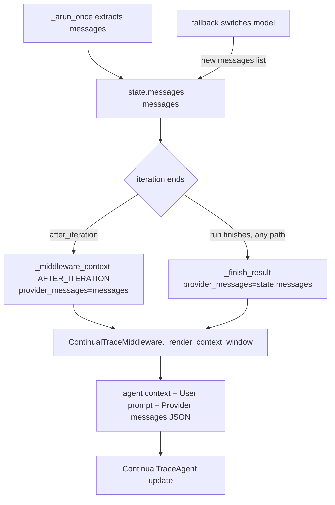

# Continual Trace Sees the Run's Messages

## Summary

The continual trace agent records what the main agent is doing (goal, actions
taken, mistakes, status), but it updates only on `after_iteration` and
`after_run`, and the runtime built those middleware contexts with empty
`provider_messages`. `ContinualTraceMiddleware._render_context_window` therefore
showed the trace agent only the system prompt, tool docs, prior-run history and
run metadata: never the current run's user prompt, tool calls, or tool results.
Every continual trace was written blind. This change hands those two hooks a
read-only snapshot of the run's live provider messages and renders the run's
user prompt, so the trace agent sees the conversation it is asked to record.

## Flow chart



## Usage example

```python
from vidbyte import Agent, TraceOption
from vidbyte.trace.continual import ActionTrace

agent = Agent(
    name="incident",
    system_prompt="Incident.",
    tools=[check],
    trace_option=TraceOption.continual(ActionTrace, every_n_iterations=1),
)
reply = agent.run("BRANCH: investigate the alternative")
# The trace agent's <main_context_window> now contains the user prompt
# ("User prompt: BRANCH: ...") and a "Provider messages:" section with the
# assistant tool call to `check` and its tool result, so reply.metadata["trace"]
# can name the goal and the actions actually taken.
```

## How it works

- `BaseAgentRuntimeLoopState` gains a `messages` field that holds the same list
  object `_arun_once` appends to. It is set right after the initial messages
  are extracted and again when a model fallback swaps in a new list.
- The three `AFTER_ITERATION` call sites in `_arun_once` pass
  `provider_messages=messages` (the local list is in scope).
- `_finish_result`, which runs `after_run` and has many callers, reads
  `state.messages` instead of growing a new parameter at every call site.
- `_middleware_context` now copies each message mapping into the tuple, so
  every hook gets a snapshot: middleware cannot mutate the runtime's list.
- The current run's user prompt is not in `messages`: the runtime passes it to
  the runner separately and the provider appends it. It is already on
  `MiddlewareContext.message`, so `_render_context_window` adds a
  `User prompt:` section from it. No other rendering or prompt change.

The provider messages for these hooks are the raw run conversation (assistant
tool calls, tool results, continuation messages). They do not include the
system message, so nothing is duplicated against `build_context()`.

## Files changed

- `vidbyte/agents/runtime.py`: loop-state field, after-hook plumbing, snapshot copy.
- `vidbyte/middleware/continual_trace.py`: render `ctx.message` as the user prompt.
- `tests/test_continual_trace.py`: regression tests.

## Risks and checks

- Other middleware reading `provider_messages`: only the compaction middleware
  (`before_model_call` only) and the continual trace. Audit and the session
  failure router implement `after_iteration`/`after_run` but never read the
  field. The pipeline only merges transforms, which after-hooks never apply.
- Subclasses: `JevRuntime` overrides `_continue_finish_attempt` and
  `_after_tool_iteration` and appends to the same list; it does not override
  `_arun_once` or `_finish_result`. Algorithms that call `_arun_once` directly
  inherit the fix. The Codex agent has its own middleware adapter, unaffected.

## Verification

- Regression tests drive a real `Agent` with a scripted offline runner and
  assert the trace agent's prompt contains the user prompt and the current
  run's tool result, both for an `after_iteration` update and for an
  `after_run`-only update (`every_n_iterations` larger than the run).
- `python lint/run.py` and `python scripts/run_ci.py`.
