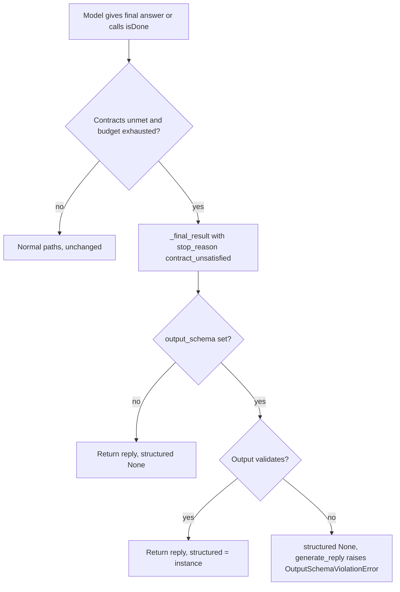

# Contract-unsatisfied runs keep their structured output

## Summary

When the output-contract engine spends its rejection budget, the linear runtime ends the run with
`stop_reason="contract_unsatisfied"`. Both exits (plain-text final answer and `isDone` finish) built
that result with `_stopped_result`, which never sets `structured`. An agent with an `output_schema`
plus an effort floor such as `MinToolCalls(2)` therefore lost a schema-valid answer, and
`BaseAgent._assert_schema_satisfied` raised `OutputSchemaViolationError` with
`validation_error=None` for an output that was a valid instance, blaming the wrong cause.

`docs/design/structured-output-guarantee.md` says contract exhaustion returning a result is correct
for effort floors, and that `OutputSchemaViolationError` is for a schema that is still unsatisfied.
This change makes the runtime match that: the two contract-unsatisfied exits validate the model's
final output against the schema exactly as a normal final answer does.

## Flow chart



## Usage example

```python
from pydantic import BaseModel
from vidbyte import Agent, tool
from vidbyte.agents import AgentLoopSettings, MinToolCalls


class Report(BaseModel):
    summary: str


@tool
def lookup(q: str) -> str:
    """Look something up."""
    return "hit"


agent = Agent(
    name="worker",
    system_prompt="Work.",
    tools=[lookup],
    output_schema=Report,
    agent_loop_settings=AgentLoopSettings(output_contracts=(MinToolCalls(2),)),
)
reply = await agent.arun("task")  # model keeps answering {"summary": "early"} without tool calls
assert reply.metadata["stop_reason"] == "contract_unsatisfied"
assert reply.structured == Report(summary="early")
```

## How it works

At the two `CONTRACT_UNSATISFIED` exits in `AgentRuntime` (linear loop), replace
`self._stopped_result(...)` with `self._final_result(..., runner_metadata={}, stop_reason=AgentStopReason.CONTRACT_UNSATISFIED)`.
`_final_result` already runs `_validated_output` (reusing the `SchemaConformance` evaluation) when
`output_schema` is set. Passing an empty `runner_metadata` keeps the result metadata identical to
what `_stopped_result` produced; the only difference is the `structured` field and the existing
`parser.structured_output` span.

If the output does not validate (the schema is among the unmet contracts), `structured` stays
`None` and `generate_reply` still raises `OutputSchemaViolationError`, now with the real
validation detail available from the run. Other stop paths (max iterations, timeout, max tokens,
middleware aborts) return canned text and are untouched.

## Files

- `vidbyte/agents/runtime.py`: the two contract-unsatisfied exits.
- `tests/test_agent_tool_loop.py`: two focused tests.

## Risks

- A caller that relied on `contract_unsatisfied` always raising when a schema is declared will now
  receive a reply. That is the documented behavior for effort floors.

## Verification

- (a) schema-valid output plus an unmet `MinToolCalls(2)` floor returns `structured` with
  `stop_reason == "contract_unsatisfied"`.
- (b) schema-invalid output with an exhausted budget still raises `OutputSchemaViolationError`.
- `python lint/run.py` and `python scripts/run_ci.py`.
