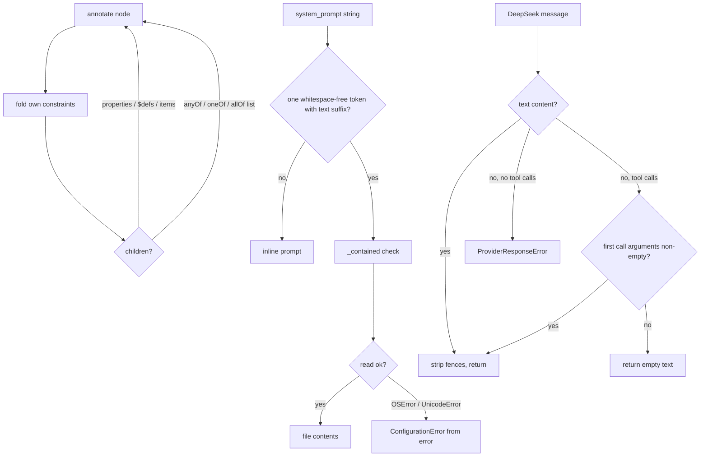

# Core fixes: schema annotation, YAML prompt references, DeepSeek tool calls

## Summary

Three independent logic bugs, one commit each:

1. `OutputSchemaFormatter.annotate` never recursed into `anyOf`/`oneOf`/`allOf`, so constraints on `Optional[X]` fields (which Pydantic emits as `anyOf: [X, null]`) stayed on the wire and were never described to the model.
2. `YamlLoader` treated any `system_prompt` ending in `.md`/`.txt`/... as a file path, so inline prose like "Save your notes to notes.md" crashed the load; real reference read failures escaped as raw `OSError`/`UnicodeDecodeError` instead of `ConfigurationError`.
3. `DeepSeekProvider` defined `_extract_chat_text` twice; the surviving copy rejected a valid tool-call turn whose first call had `arguments: ""` (a zero-parameter tool), aborting the agent run.

## Flow chart



## Usage example

```python
from pydantic import BaseModel, Field
from vidbyte.providers.output_schema import OutputSchemaFormatter

class Invoice(BaseModel):
    discount: float | None = Field(default=None, ge=0, le=1)

schema = OutputSchemaFormatter().annotate(OutputSchemaFormatter().resolve_schema(Invoice))
# schema["properties"]["discount"]["anyOf"][0] now has no minimum/maximum and a "Must be ..." description.
```

```yaml
# Both stay inline prompts; only `system_prompt: ./prompt.md` is a file reference.
system_prompt: You are a writer. Save your notes to notes.md
```

## How it works

- **Schema:** `_annotate_node` gains one loop over list-valued `anyOf`/`oneOf`/`allOf`, recursing into each dict branch.
- **YAML:** a new `_is_file_reference` helper requires a non-empty, whitespace-free single token with a supported suffix. `_load_file` wraps `read_text` in `try/except (OSError, UnicodeError)` and raises `ConfigurationError(... details={field, path, error_type}) from error`. `_contained` is unchanged.
- **DeepSeek:** delete the dead first definition (the survivor already keeps its fence stripping and non-string content check). When the extracted text is empty and the message carries tool calls, return `""` like the base provider; empty text with no tool calls still raises.

## Files

- `vidbyte/providers/output_schema.py`, `tests/test_output_schema_formatter.py` (new)
- `vidbyte/config/loader.py`, `vidbyte/config/README.md`, `tests/test_agent_settings_validation.py`
- `vidbyte/providers/compatible.py`, `tests/test_deepseek_provider.py` (new)

## Risks

- A prompt file whose name contains a space is no longer treated as a reference. The documented and tested syntax (`./prompt.md`) has no spaces, so this is the narrowest rule that stops prose being read as a path.
- DeepSeek plain-text replies are unchanged, including the error for a reply with neither text nor tool calls.

## Verification

One regression test per bug, each confirmed failing on `main` and passing with the fix; `python lint/run.py`, the touched test files, `python -m pytest -q -x`, and CI (Source 3.11/3.12, Package, Static policy).
