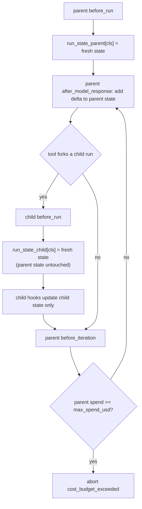

# Cost Budget and Backoff Retry Per-Run State

## Summary

`CostBudgetMiddleware` and `ExponentialBackoffRetryMiddleware` still keep per-run counters on the middleware instance and reset them in `before_run`. One instance is shared by every run that uses it, and `BaseAgent.fork()` (so `ForkConversationTool` and `AgentTool` delegation of a forked agent) reuses the parent's middleware instances for a child run that executes inside the parent's run. The child's `before_run` therefore zeroes the parent's accumulated spend or attempt count mid-run. Reproduced: a 2000-token cost budget that aborts after 4 parent calls with a local tool never aborts when each turn delegates through `ForkConversationTool` (8 parent calls, 2x the budget). This change moves both middlewares onto the per-run `ctx.run_state` rule set by [concurrent-middleware-safety.md](concurrent-middleware-safety.md).

## Flow chart



## Usage example

```python
from vidbyte import Agent
from vidbyte.middleware.builtins import CostBudgetMiddleware, ExponentialBackoffRetryMiddleware
from vidbyte.tools.builtins import ForkConversationTool

budget = CostBudgetMiddleware(max_spend_usd=0.002, cost_per_million_tokens=1.0)
agent = Agent(
    name="researcher",
    system_prompt="Delegate subtasks with fork_conversation.",
    provider="openai",
    model_name="gpt-4.1",
    tools=[ForkConversationTool()],
    middleware=[budget, ExponentialBackoffRetryMiddleware(max_attempts=3)],
)
result = agent.run("Research and summarize.")  # forks share `budget` but not its counters
result.stop_reason        # "middleware_abort" once the parent run reaches $0.002
budget.estimated_spend_usd  # most recent estimate written by any run on this instance
```

## How it works

- New mutable dataclasses `CostBudgetRunState` (accumulated tokens, last tokens seen, estimated spend) and `ExponentialBackoffRetryRunState` (attempts) in `vidbyte/lib/dataclasses/middleware.py`, per the placement rules.
- `before_run` stores a fresh state at `ctx.run_state[self.__class__]`; every other hook reads it through `_state_for(ctx)`, which lazily creates state for direct hook calls, matching `TokenBudgetMiddleware`.
- `CostBudgetMiddleware.estimated_spend_usd` stays as a public read and mirrors the most recent update from any run. A new `estimated_spend_usd_for(run_state)` returns one run's spend, and `AgentRuntime._cost_spent_usd` (the `cost_spent_usd` output-contract counter) now reads it from the run's own `run_state`, so a child run cannot change the parent's reported spend.
- Thresholds, deltas, delays, and abort reasons/metadata are unchanged for a single run.

## Files

- `vidbyte/lib/dataclasses/middleware.py`: two run-state dataclasses.
- `vidbyte/middleware/builtins/cost_budget.py`, `vidbyte/middleware/builtins/exponential_backoff_retry.py`: state moved to `ctx.run_state`.
- `vidbyte/agents/runtime.py`: `_contract_counters` passes `run_state` to `_cost_spent_usd`.
- `tests/test_new_middleware_builtins.py`: existing tests share one `run_state` per simulated run; nested-run regression tests.

## Risks

- Callers that drive hooks directly with a fresh `MiddlewareContext` per hook no longer accumulate across those calls; the runtime always threads one `run_state` per run, and the existing tests were updated to do the same.
- `estimated_spend_usd` on a shared instance is "last writer wins" across runs; per-run values come from `estimated_spend_usd_for`.

## Verification

- New tests call a second `before_run` with a separate `run_state` between the first run's hooks and assert the first run still aborts at its budget / exhausts its attempts; both fail on `main`.
- `python scripts/run_ci.py` locally, then `ci.yml` and `static-policy.yml` on the branch.
