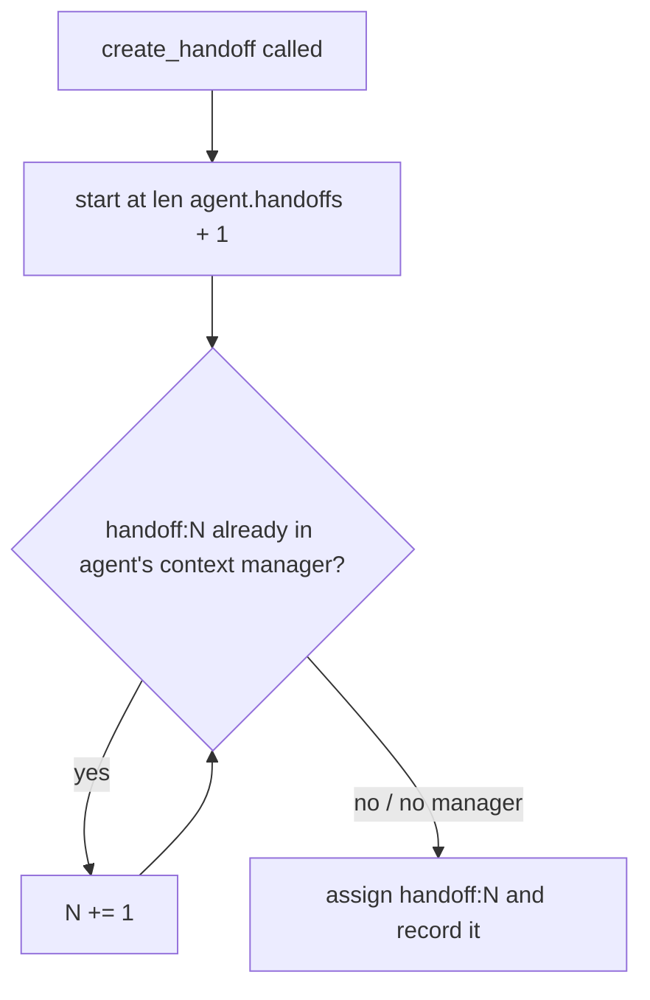

# create_handoff never overwrites a registered handoff

## Summary

`CreateHandoffTool` numbered each new handoff from the agent's own `handoffs` list only. A forked child, a second agent sharing a `ContextManager`, or a restored manager can already hold `handoff:N` entries that list does not know about, so the new handoff silently replaced an unrelated handoff in the model's context. The fix skips any `handoff:N` id already registered in the bound agent's context manager.

## Flow chart



## Usage example

```python
manager = ContextManager()
alpha = Agent(name="alpha", system_prompt="...", tools=[CreateHandoffTool()], context_manager=manager)
beta = Agent(name="beta", system_prompt="...", tools=[CreateHandoffTool()], context_manager=manager)
# alpha authors handoff:1; beta's first handoff now becomes handoff:2 instead of replacing it.
```

## How it works

`_next_primitive_id` keeps its starting point (`len(handoffs) + 1`), so a plain single agent still gets `handoff:1`, `handoff:2`, ... It then increments while `context_manager.get_by_id(f"handoff:{n}")` returns an item. The tool-binding entry keyed plain `"handoff"` never matches the `handoff:N` form. Fork semantics and `record_handoff` are unchanged.

## Files

- `vidbyte/tools/builtins/handoff/create.py`: skip registered ids.
- `tests/test_create_handoff_tool.py`: shared-manager regression test.

## Risks

None known; agents without a context manager behave exactly as before.

## Verification

New regression test, `python lint/run.py`, `python scripts/run_ci.py`, PR CI.
