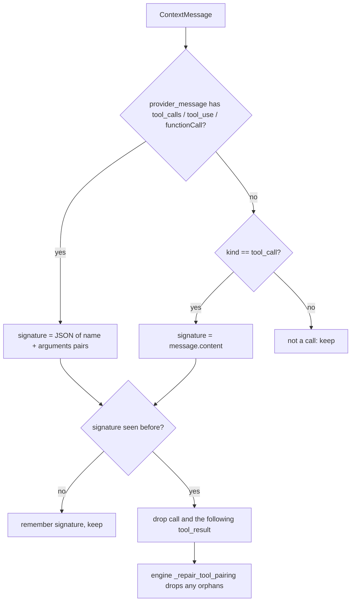

# Deduplicate Tool Calls Ignores Call Ids

## Summary

`DeduplicateToolCallsCompaction` keyed duplicates on `ContextMessage.content`. For provider messages that content is the rendered message, which includes the unique per-call id (OpenAI `tool_calls[*].id`, Anthropic `tool_use.id`), so two identical calls never matched and `MessageHistoryCompactionMiddleware.deduplicate_tool_calls()` removed nothing. Anthropic `tool_use` turns were also classified as plain messages, so the strategy never looked at them. The fix keys each call on its tool names plus arguments, read from the original provider message.

## Flow chart



## Usage example

```python
from vidbyte.middleware.builtins import MessageHistoryCompactionMiddleware

agent = Agent(
    system_prompt="Answer with the lookup tool.",
    tools=[lookup],
    middleware=[MessageHistoryCompactionMiddleware.deduplicate_tool_calls()],
)
# lookup(q="q1") twice with different call ids now leaves one call/result pair in the next request.
```

## How it works

A new helper `tool_call_signature(message)` returns an id-free key: OpenAI `tool_calls[*].function.{name, arguments}`, Anthropic `content[*]` `tool_use` `{name, input}`, Gemini `parts[*].functionCall` `{name, args}`. With no provider message it falls back to `message.content` for `tool_call` records, so ContextMessage-based callers behave as before. First occurrence still wins and the following tool result is still removed.

## Files

- `vidbyte/middleware/compaction/call_signature.py` (new helper; kept out of `strategies.py`, which is near 1,000 lines)
- `vidbyte/middleware/compaction/strategies.py` (`DeduplicateToolCallsCompaction` uses the signature)
- `tests/test_deterministic_compaction_middleware.py` (OpenAI and Anthropic regression tests)

## Risks

- OpenAI arguments are compared as the raw JSON string, so the same arguments with different whitespace or key order are not merged.
- A duplicate Anthropic turn that also carries text loses that text along with the call.
- `_provider_message_content` and `_provider_message_kind` are unchanged, so other modes are unaffected.

## Verification

New engine-level tests for OpenAI and Anthropic shapes, existing compaction tests, `python lint/run.py`, `python scripts/run_ci.py`.
